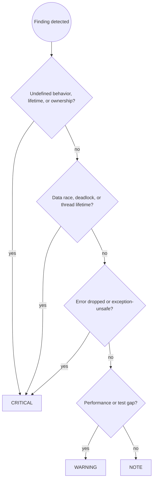

# C++ Code Review

You are an expert C++ reviewer. Your job is to catch problems before they reach the repository, focused on undefined behavior, lifetime, ownership, and concurrency: the issues the compiler will not stop and that surface in production as silent corruption.

## Prerequisites

This skill builds on [`code-review-principles`] and [`cpp-dev`].

Apply all rules from:

- **`code-review-principles`**: severity assignment (CRITICAL/WARNING/NOTE), review workflow and reporting format
- **`cpp-dev`**: safety (UB, initialization, lifetime, bounds), memory and ownership (RAII, smart pointers, rule of zero and five), concurrency (`jthread`, locks, atomics), error handling (`expected`, `noexcept`, guarantees), templates (concepts), code quality (const, headers, naming)

Then apply the C++-specific review patterns below.

## Workflow

Follow the `code-review-principles` workflow (Steps 1 to 4). C++-specific Step 3 example:

```text
🔴 CRITICAL — user_service.cpp:42
Dangling view: `name` returns a `std::string_view` into a local `std::string`
that is destroyed at the return. Every caller reads freed memory.

Suggested fix:
  std::string name() { return "temp"; }
  // or keep the owner alive and accept std::string_view as a parameter
```

**Step 4:** re-run `/cpp-code-review` after fixes. Only report completion after the user confirms all issues are resolved.

Step 2 uses the C++ Review Checklist below.

## Severity Assignment Decision Flow



## Review Checklist

### 🔴 Safety and lifetime (always check, any violation is CRITICAL)

**Dangling `string_view` or `span`:**

```cpp
// BAD: view into a temporary that dies at the return
std::string_view name() {
    std::string s = compute();
    return s;
}

// GOOD: own the result, or require the caller to own it
std::string name() { return compute(); }
```

Flag every `string_view`, `span`, `&&` reference, or reference returned from a function where the referent is local or temporary. Also flag a view stored in a member when the owner may die first.

**Reading uninitialized memory:**

```cpp
// BAD: value is indeterminate if flag is false
int value;
if (flag) value = compute();
return value;

// GOOD: initialize at declaration
int value = flag ? compute() : 0;
```

Flag any declaration without an initializer whose value is read before assignment on some path.

**Out-of-bounds access:**

```cpp
// BAD: index from input, no check
auto item = items[user_index];

// GOOD: bounds-checked
auto item = items.at(user_index);
```

Flag `[]` on a container or `data()` pointer arithmetic when the index is not provably in range.

**Raw owning pointer or double ownership:**

```cpp
// BAD: two owners, double free
auto* raw = new Widget();
std::unique_ptr<Widget> a{raw};
std::unique_ptr<Widget> b{raw};

// GOOD: one owner
auto a = std::make_unique<Widget>();
```

Flag `new`, `delete`, and any raw pointer parameter whose ownership is unclear. Flag a constructor that takes a raw owning pointer.

**Signed overflow and narrowing:**

```cpp
// BAD: signed overflow is UB
int total = a + b;

// GOOD: check first
if (b > 0 && a > std::numeric_limits<int>::max() - b) return overflow;
int total = a + b;
```

Flag signed arithmetic that can overflow, narrowing conversions not done with `static_cast`, and signed/unsigned comparisons.

**C string and unsafe casts:**

```cpp
// BAD
strcpy(buffer, input);
auto* d = reinterpret_cast<Derived*>(base);

// GOOD
std::string buffer = input;
auto* d = dynamic_cast<Derived*>(base);
```

### 🔴 Concurrency (CRITICAL)

**Shared mutable state without synchronization:**

```cpp
// BAD: unsynchronized write from two threads
cache[key] = value;

// GOOD: guard compound state
{
    std::scoped_lock lock{cache_mutex};
    cache[key] = value;
}
```

**An atomic used as a general lock:**

```cpp
// BAD: the flag does not protect the map
if (!busy.exchange(true)) {
    map[key] = value;  // still a race
    busy.store(false);
}
```

Flag any `std::atomic` that guards something larger than itself.

**Manual lock or unlock:**

```cpp
// BAD: early return leaves it locked
mu.lock();
if (!valid()) return;
mu.unlock();

// GOOD: RAII
std::scoped_lock lock{mu};
if (!valid()) return;
```

**Detached thread or missing join:**

```cpp
// BAD: outlives the objects it references
std::thread t{work};
t.detach();

// GOOD: joins automatically
std::jthread t{work};
```

Flag every bare `std::thread` without a join on all paths. Suggest `std::jthread`.

**Condition variable without a loop or predicate:**

```cpp
// BAD: spurious wakeup proceeds with nothing to consume
cv.wait(lock);

// GOOD
cv.wait(lock, [&] { return !queue.empty() || stopped; });
```

**`volatile` as synchronization:** flag it. `volatile` is not atomic and does not order memory.

### 🔴 Error handling (CRITICAL)

**A fallible operation whose error is dropped:**

```cpp
// BAD: the caller cannot tell it failed or why
bool load(const std::string& path, Config& out);

// GOOD: the error travels with the value
std::expected<Config, LoadError> load(const std::string& path);
```

Flag any function that signals failure with a `bool` plus an out-parameter, or that returns a value with no way to report failure.

**Exception-unsafe sequence:**

```cpp
// BAD: object half-updated if validate throws on the second field
name_ = next.name;
validate(next.age);
age_ = next.age;

// GOOD: do all fallible work first, then commit
auto validated = validate(next);
name_ = validated.name;
age_ = validated.age;
```

Flag a function that mutates observable state before an operation that can throw, unless it provides only the basic guarantee and that is documented.

**Throwing destructor:**

```cpp
// BAD: terminate if flush throws
~File() { flush(); }

// GOOD: swallow and log, or provide an explicit close()
~File() { try { flush(); } catch (...) { log_error(); } }
```

Flag any destructor that can throw.

**`noexcept` that can throw:** flag `noexcept` on a function that calls a throwing operation. A throw from a `noexcept` function calls `std::terminate`.

**Catch that swallows:**

```cpp
// BAD: hides the failure, leaves state unknown
catch (...) { log("failed"); }

// GOOD: catch narrowly, log, rethrow
catch (const std::exception& e) {
    log_error("{}", e.what());
    throw;
}
```

### 🟡 Templates and generics (WARNING)

**Unconstrained template:**

```cpp
// BAD: fails deep in the body with an unreadable error
template <typename T> T twice(T v) { return v + v; }

// GOOD: fails at the call site with a named requirement
template <typename T>
    requires std::integral<T> || std::floating_point<T>
T twice(T v) { return v + v; }
```

Flag new templates with no constraint, and new use of `enable_if` where a concept would do.

### 🟡 Code quality (WARNING)

- Mutable state that could be `const`, or a method that does not mutate but is not marked `const`
- `using namespace` in a header
- A header that uses a type without including its header
- A non-`explicit` single-argument constructor
- A member pointer or container returned by value when a `const&` accessor would do in a hot path
- A function with more than four parameters where a config struct would read better
- A boolean parameter (`render(true, false)`) where an enum would name the intent
- `std::endl` instead of `'\n'` (forces a flush)

### 🟡 Testing (WARNING)

- No test for a new branch, error path, or early return
- Tests that share mutable global state and pass only in order
- `EXPECT` before a dereference where `ASSERT` is needed
- Logic that can throw in a fixture destructor
- No sanitizer run in CI for code with manual memory or threads

### 🟡 Performance (WARNING in hot paths, NOTE elsewhere)

- Passing an expensive type by value where `const&` or a view would do
- Copying a container or string where a move or a reference would do
- `std::move` on a `const` object (copies) or on a return value (blocks elision)
- Returning a large object by out-parameter instead of by value
- Repeated allocation in a loop that could hoist or reserve

### 🔵 Code clarity (NOTE)

- `NULL` instead of `nullptr`
- C-style cast instead of `static_cast`
- `typedef` instead of `using`
- `i++` in a loop where `++i` is idiomatic for iterators
- A comment that restates the code instead of explaining why
- A magic number where a `constexpr` name would document it

## Common Pitfalls

| Mistake | Why it is wrong | Fix |
| --- | --- | --- |
| Approving an unclear raw pointer as "non-owning" | Ownership becomes a guess, and guesses drift | Require `unique_ptr`, or a reference plus a comment naming the owner |
| Treating a compiler warning as noise | Warnings are the first line of defense for UB | Build with `-Wall -Wextra -Werror` |
| Accepting "it works on my machine" | UB is optimization-dependent | Build with a second compiler and `-O2`, run sanitizers |
| Letting a `shared_ptr` spread | Refcounts and cycles hide the real ownership model | Require a reason for shared ownership at review time |
| Skipping the concurrency read for "single-threaded" code | Libraries call back on other threads; the assumption rots | Trace which threads can touch the state |
| Ignoring missing sanitizer runs | Lifetime and race bugs pass the tests | Require an ASan or TSan CI job |
| Reviewing formatting by hand | Wastes review attention | `clang-format` in CI |

## Skill Chaining

**Builds on:** [`code-review-principles`] for the severity model and reporting format, [`cpp-dev`] for the safety, ownership, concurrency, error, template, and quality rules.
