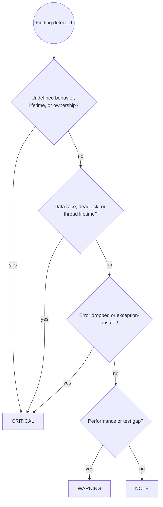

# C++ Code Review

You are an expert C++ reviewer. Your job is to catch problems before they reach the repository, focused on undefined behavior, lifetime, ownership, and concurrency: the issues the compiler will not stop and that surface in production as silent corruption.

## Prerequisites

This skill builds on [`code-review-principles`] and [`cpp-dev`].

Apply all rules from:

- **`code-review-principles`**: severity assignment (CRITICAL/WARNING/NOTE), review workflow and reporting format
- **`cpp-dev`**: safety (UB, initialization, lifetime, bounds), memory and ownership (RAII, smart pointers, rule of zero and five), concurrency (`jthread`, locks, atomics), error handling (`expected`, `noexcept`, guarantees), templates (concepts), code quality (const, headers, naming)

Then apply the C++-specific review patterns below.

## Workflow

Follow the `code-review-principles` workflow (Steps 1 to 4). C++-specific Step 3 example:

```text
🔴 CRITICAL — user_service.cpp:42
Dangling view: `name` returns a `std::string_view` into a local `std::string`
that is destroyed at the return. Every caller reads freed memory.

Suggested fix:
  std::string name() { return "temp"; }
  // or keep the owner alive and accept std::string_view as a parameter
```

**Step 4:** re-run `/cpp-code-review` after fixes. Only report completion after the user confirms all issues are resolved.

Step 2 uses the C++ Review Checklist below.

## Severity Assignment Decision Flow


```mermaid
flowchart TD
    Finding_detected((Finding detected))
    UB_or_lifetime_{Undefined behavior, lifetime, or ownership?}
    Concurrency_{Data race, deadlock, or thread lifetime?}
    Errors_{Error dropped or exception-unsafe?}
    CRITICAL[CRITICAL]
    Perf_or_test_{Performance or test gap?}
    WARNING[WARNING]
    NOTE[NOTE]
    Finding_detected --> UB_or_lifetime_
    UB_or_lifetime_ -->|yes| CRITICAL
    UB_or_lifetime_ -->|no| Concurrency_
    Concurrency_ -->|yes| CRITICAL
    Concurrency_ -->|no| Errors_
    Errors_ -->|yes| CRITICAL
    Errors_ -->|no| Perf_or_test_
    Perf_or_test_ -->|yes| WARNING
    Perf_or_test_ -->|no| NOTE
```

## Review Checklist

### 🔴 Safety and lifetime (always check, any violation is CRITICAL)

**Dangling `string_view` or `span`:**

```cpp
// BAD: view into a temporary that dies at the return
std::string_view name() {
    std::string s = compute();
    return s;
}

// GOOD: own the result, or require the caller to own it
std::string name() { return compute(); }
```

Flag every `string_view`, `span`, `&&` reference, or reference returned from a function where the referent is local or temporary. Also flag a view stored in a member when the owner may die first.

**Reading uninitialized memory:**

```cpp
// BAD: value is indeterminate if flag is false
int value;
if (flag) value = compute();
return value;

// GOOD: initialize at declaration
int value = flag ? compute() : 0;
```

Flag any declaration without an initializer whose value is read before assignment on some path.

**Out-of-bounds access:**

```cpp
// BAD: index from input, no check
auto item = items[user_index];

// GOOD: bounds-checked
auto item = items.at(user_index);
```

Flag `[]` on a container or `data()` pointer arithmetic when the index is not provably in range.

**Raw owning pointer or double ownership:**

```cpp
// BAD: two owners, double free
auto* raw = new Widget();
std::unique_ptr<Widget> a{raw};
std::unique_ptr<Widget> b{raw};

// GOOD: one owner
auto a = std::make_unique<Widget>();
```

Flag `new`, `delete`, and any raw pointer parameter whose ownership is unclear. Flag a constructor that takes a raw owning pointer.

**Emplacement that perfect-forwards a raw owning pointer:**

```cpp
// BAD: if node allocation throws after new succeeds, the Widget leaks
ptrs.emplace_back(new Widget, killWidget);

// GOOD: acquire into a manager first, then move it in
auto spw = std::shared_ptr<Widget>(new Widget, killWidget);
ptrs.emplace_back(std::move(spw));
```

Flag `emplace_back`/`emplace` that forwards a raw `new` pointer before a managing object owns it.

**Two shared_ptr objects from one raw pointer:**

Two shared_ptr constructed from the same raw pointer get separate control blocks, so each refcount believes it is the sole owner and the object is destroyed twice.

```cpp
// BAD: pw gets two control blocks
auto* pw = new Widget;
std::shared_ptr<Widget> a(pw);
std::shared_ptr<Widget> b(pw);

// GOOD: one allocation, one owner chain
auto a = std::make_shared<Widget>();
auto b = a;
```

Flag a raw pointer passed to more than one shared_ptr constructor, and a class that hands out `shared_ptr(this)` instead of inheriting `enable_shared_from_this` and calling `shared_from_this()`.

**Signed overflow and narrowing:**

```cpp
// BAD: signed overflow is UB
int total = a + b;

// GOOD: check first
if (b > 0 && a > std::numeric_limits<int>::max() - b) return overflow;
int total = a + b;
```

Flag signed arithmetic that can overflow, narrowing conversions not done with `static_cast`, and signed/unsigned comparisons.

**C string and unsafe casts:**

```cpp
// BAD
strcpy(buffer, input);
auto* d = reinterpret_cast<Derived*>(base);

// GOOD
std::string buffer = input;
auto* d = dynamic_cast<Derived*>(base);
```

**Cross-translation-unit static initialization:**

A namespace-scope static whose constructor reads another namespace-scope object from a different translation unit runs in an unspecified order. If this one runs first, it reads unconstructed memory.

```cpp
// BAD: registry may not be constructed when default_widget is
extern WidgetRegistry registry;
Widget default_widget{registry.lookup("default")};

// GOOD: construct on first use, so the order no longer matters
Widget& default_widget() {
    static Widget w = WidgetRegistry::instance().lookup("default");
    return w;
}
```

Flag a namespace-scope object whose initializer calls into another translation unit's global.

**Deleting through a base pointer without a virtual destructor:**

```cpp
// BAD: ~Derived never runs, undefined behavior
struct Base { ~Base() = default; };
struct Derived : Base { std::vector<int> data; };

Base* p = new Derived();
delete p;
```

Flag a base class with virtual functions (or meant for polymorphic use) whose destructor is not virtual and is deleted through a base pointer.

**Dangling lambda captures:**

A lambda that outlives its scope must not hold references. `[&]` stored or returned dangles, and `[=]` in a member function captures `this` by pointer, which dangles once the object dies.

```cpp
// BAD: the returned closure holds a reference to a dead local
std::function<int(int)> make_filter() {
    int threshold = 1;
    return [&](int v) { return v > threshold; };
}

// BAD: [=] captures this by pointer, so the object may die first
void Widget::addFilter() {
    filters.emplace_back([=](int v) { return v % divisor == 0; });
}

// GOOD: capture the value explicitly
void Widget::addFilter() {
    filters.emplace_back([divisor = divisor](int v) {
        return v % divisor == 0;
    });
}
```

Flag a stored or returned lambda with a default capture, and any `[=]` in a member function that reads a data member.

**An `auto` variable that deduces a proxy type:**

`std::vector<bool>::operator[]` returns a proxy that holds a pointer into the vector, not a `bool`. If the vector is a temporary, the proxy dangles after the statement.

```cpp
// BAD: highPriority is a proxy into a dead temporary
auto highPriority = features(w)[5];

// GOOD: force the value with an explicit cast
auto highPriority = static_cast<bool>(features(w)[5]);
```

Flag `auto` that binds the result of a container accessor known to return a proxy (`vector<bool>::reference`, expression templates) when the container is a temporary, or where a deliberate narrowing cast documents intent.

**Dereferencing an empty optional:**

`*opt` and `opt->` on an optional that holds no value are undefined behavior. Unlike `variant`, `optional` does not throw; only `opt.value()` throws `std::bad_optional_access`.

```cpp
// BAD: UB if find_user returned an empty optional
auto user = find_user(id);
log(user->name);

// GOOD: check first, or use value() where a throw is acceptable
if (auto user = find_user(id)) log(user->name);
```

Flag `*opt`, `opt->`, or an implicit conversion on an optional that is not proven engaged.

### 🔴 Concurrency (CRITICAL)

**Shared mutable state without synchronization:**

```cpp
// BAD: unsynchronized write from two threads
cache[key] = value;

// GOOD: guard compound state
{
    std::scoped_lock lock{cache_mutex};
    cache[key] = value;
}
```

**An atomic used as a general lock:**

```cpp
// BAD: the flag does not protect the map
if (!busy.exchange(true)) {
    map[key] = value;  // still a race
    busy.store(false);
}
```

Flag any `std::atomic` that guards something larger than itself.

**A const member function that writes mutable state:**

A const member may be called concurrently. A cache it writes must be protected.

```cpp
// BAD: concurrent calls race on rootsAreValid/rootVals
RootsType roots() const {
    if (!rootsAreValid) { rootVals = compute(); rootsAreValid = true; }
    return rootVals;
}

// GOOD: a mutex guards the pair (two fields that change together)
RootsType roots() const {
    std::scoped_lock lock{m};
    if (!rootsAreValid) { rootVals = compute(); rootsAreValid = true; }
    return rootVals;
}
```

**Manual lock or unlock:**

```cpp
// BAD: early return leaves it locked
mu.lock();
if (!valid()) return;
mu.unlock();

// GOOD: RAII
std::scoped_lock lock{mu};
if (!valid()) return;
```

**Detached thread or missing join:**

```cpp
// BAD: outlives the objects it references
std::thread t{work};
t.detach();

// GOOD: joins automatically
std::jthread t{work};
```

Flag every bare `std::thread` without a join on all paths. Suggest `std::jthread`.

**Condition variable without a loop or predicate:**

```cpp
// BAD: spurious wakeup proceeds with nothing to consume
cv.wait(lock);

// GOOD
cv.wait(lock, [&] { return !queue.empty() || stopped; });
```

**`volatile` as synchronization:** flag it. `volatile` is not atomic and does not order memory.

**Task-based work expressed as a bare thread:**

- A `std::thread` with hand-rolled result passing where `std::async`, `std::future`, or `std::packaged_task` would return the result and propagate exceptions
- `std::async` without `std::launch::async` where asynchrony is required; the default policy may run the task deferred, so a `wait_for` loop never sees `ready`

**A future that blocks in its destructor:**

The last future to a non-deferred `std::async` task blocks until the task completes when it is destroyed. A container of futures, or a class holding a `shared_future`, can therefore stall shutdown.

```cpp
// BAD: the vector's destructor blocks on the last async task
std::vector<std::future<void>> workers;
for (auto& job : jobs) workers.push_back(std::async(std::launch::async, job));

// The wait is implicit; make it explicit when it is intended
for (auto& f : workers) f.get();
```

Flag a future or container of futures whose destructor may wait on a task, and note when the wait is intended.

**Polling a flag where a one-shot wait would do:**

An `atomic<bool>` polled in a loop burns a core and delays. A `std::promise<void>` paired with a `future` blocks without a mutex and without missing an early signal.

```cpp
// BAD: spins while waiting for the event
std::atomic<bool> ready{false};
while (!ready.load()) std::this_thread::yield();

// GOOD: the reacting task blocks until set_value
std::promise<void> p;
auto fut = p.get_future();
std::jthread reactor{[&] { fut.wait(); react(); }};
// ... configure, then release
p.set_value();
```

Flag a spin or `yield` loop waiting on a flag where a `promise`/`future` one-shot channel expresses the wait.

### 🔴 Error handling (CRITICAL)

**A fallible operation whose error is dropped:**

```cpp
// BAD: the caller cannot tell it failed or why
bool load(const std::string& path, Config& out);

// GOOD: the error travels with the value
std::expected<Config, LoadError> load(const std::string& path);
```

Flag any function that signals failure with a `bool` plus an out-parameter, or that returns a value with no way to report failure.

**Exception-unsafe sequence:**

```cpp
// BAD: object half-updated if validate throws on the second field
name_ = next.name;
validate(next.age);
age_ = next.age;

// GOOD: do all fallible work first, then commit
auto validated = validate(next);
name_ = validated.name;
age_ = validated.age;
```

Flag a function that mutates observable state before an operation that can throw, unless it provides only the basic guarantee and that is documented.

**Throwing destructor:**

```cpp
// BAD: terminate if flush throws
~File() { flush(); }

// GOOD: swallow and log, or provide an explicit close()
~File() { try { flush(); } catch (...) { log_error(); } }
```

Flag any destructor that can throw.

**`noexcept` that can throw:** flag `noexcept` on a function that calls a throwing operation. A throw from a `noexcept` function calls `std::terminate`.

**Catch that swallows:**

```cpp
// BAD: hides the failure, leaves state unknown
catch (...) { log("failed"); }

// GOOD: catch narrowly, log, rethrow
catch (const std::exception& e) {
    log_error("{}", e.what());
    throw;
}
```

### 🟡 Templates and generics (WARNING)

**Unconstrained template:**

```cpp
// BAD: fails deep in the body with an unreadable error
template <typename T> T twice(T v) { return v + v; }

// GOOD: fails at the call site with a named requirement
template <typename T>
    requires std::integral<T> || std::floating_point<T>
T twice(T v) { return v + v; }
```

Flag new templates with no constraint, and new use of `enable_if` where a concept would do.

**A perfect-forwarding constructor or an overload on a universal reference:**

A `T&&` parameter with deduced `T` is an exact match for nearly every argument, so it captures calls meant for other overloads, including the compiler-generated copy and move constructors.

```cpp
// BAD: the forwarding ctor beats the copy ctor for a non-const lvalue
struct Person {
    template <typename T> explicit Person(T&& n) : name(std::forward<T>(n)) {}
    Person(const Person&);   // "Nancy" lvalue binds the template instead
};

// GOOD: constrain it away from the class's own type
template <typename T>
    requires (!std::same_as<std::remove_cvref_t<T>, Person>)
explicit Person(T&& n) : name(std::forward<T>(n)) {}
```

Flag a constructor or overload whose `T&&` parameter is unconstrained and competes with another overload or a special member function.

**Perfect-forwarding failure cases (NOTE):**

`T&&` forwarding fails to deduce for a few argument shapes. Wrap a braced initializer in `auto il = {...}` and forward that, pass `nullptr` instead of `0`/`NULL`, define a declaration-only integral `static const` member in a `.cpp` before forwarding it, pin an overloaded or templated function name to a concrete type with `using`, and copy a bitfield into a local before forwarding.

### 🟡 Code quality (WARNING)

- Mutable state that could be `const`, or a method that does not mutate but is not marked `const`
- `using namespace` at namespace scope in a header or a source file, and any namespace-scope using-declaration in a header, even for a single name, because it leaks into every includer. In a source file, prefer a using-declaration for the specific name (`using std::cout;`) or a narrow function-scope directive when the file uses only that one name
- Initialization whose meaning depends on the delimiter: `std::vector<int> v{10}` builds one element when ten were intended, while `v(10)` builds ten. Flag `{}` where a size or constructor-argument list was meant, and flag `()` where the narrowing check of braces was the point
- A built-in C array (`T a[N]`) or a C string where `std::array`, `std::vector`, `std::string`, or `std::span` would carry the size and bounds
- A naked union or a hand-rolled tagged union where `std::variant` expresses the alternatives, or a read of a union member that may not be the active one
- An unscoped `enum` in new code where `enum class` would keep enumerators scoped and block implicit conversion to integers
- `push_back(T{...})` or `push_back(make_pair(...))` where `emplace_back(...)` would construct the element in place, or the reverse when the container is a unique-keyed set and the argument is already the element type
- A virtual function that overrides a base virtual without the `override` keyword
- An explicit local type where `auto` avoids a silent mismatch, such as `unsigned sz = v.size()` (truncates on 64-bit) or `for (const std::pair<std::string,int>& p : m)` (copies every element)
- `auto` where a reference was intended, so `auto x = v[i]` copies and later writes go to the copy instead of the element; use `auto&` or `const auto&`, and `const auto&` in read-only range-for loops over non-trivial types
- A header that uses a type without including its header
- A non-`explicit` single-argument constructor
- A member pointer or container returned by value when a `const&` accessor would do in a hot path
- A function with more than four parameters where a config struct would read better
- A boolean parameter (`render(true, false)`) where an enum would name the intent
- `std::endl` instead of `'\n'` (forces a flush)
- `printf`/`scanf` with a literal format string where `std::format` or iostreams would be typesafe and support user-defined types; a runtime-selected format string is a valid reason to keep `printf` when it is not built from untrusted input
- A polymorphic base type passed or stored by value, which slices off the derived part; use a reference, pointer, or smart pointer instead
- A type that defines `==` but not `!=`, or `<` without the derived comparisons, so the usual equivalences do not hold; a key type for an unordered container without a matching `hash` and equality
- `#define` used for a constant, a small function, or a type alias where `constexpr`, an `enum class`, an `inline` function, or `using` would keep type checking and scope
- `std::move` applied to a universal reference (`T&&` with deduced `T`), which silently moves an lvalue caller's argument; use `std::forward<T>` on universal references and reserve `std::move` for concrete rvalue references

### 🟡 Testing (WARNING)

- No test for a new branch, error path, or early return
- Tests that share mutable global state and pass only in order
- `EXPECT` before a dereference where `ASSERT` is needed
- Logic that can throw in a fixture destructor
- No sanitizer run in CI for code with manual memory or threads

### 🟡 Performance (WARNING in hot paths, NOTE elsewhere)

- Passing an expensive type by value where `const&` or a view would do
- Copying a container or string where a move or a reference would do
- `std::move` on a `const` object (copies) or on a return value (blocks elision)
- Returning a large object by out-parameter instead of by value
- Repeated allocation in a loop that could hoist or reserve

### 🔵 Code clarity (NOTE)

- `0` or `NULL` used as a null pointer constant instead of `nullptr`, which avoids the overload and template-deduction surprises that `0` and `NULL` cause
- A constant or simple function that qualifies for `constexpr` but is not marked, so it cannot be used in a constant expression (array size, template argument, `static_assert`)
- Raw untyped memory accessed through `char*` or `unsigned char*` where `std::byte` would express the intent
- C-style cast instead of `static_cast`
- `typedef` instead of `using`
- A private, never-defined member function used to disable an operation, where `= delete` (declared `public`) gives a clear compile-time error at the call site
- `i++` in a loop where `++i` is idiomatic for iterators
- A mutable iterator (`.begin()`/`.end()`) where `.cbegin()`/`.cend()` or a `const` container would express read-only access
- A hand-written index or accumulator loop where a range-for or a standard algorithm (`std::find_if`, `std::accumulate`, `std::transform`, `std::any_of`) states the intent more directly
- `std::bind` where a lambda states the intent more directly and captures explicitly
- A `std::pair` or `std::tuple` whose `first`/`second` or `get<0>` access hides the field meanings where a small named struct would document them
- A comment that restates the code instead of explaining why
- A magic number where a `constexpr` name would document it

## Common Pitfalls

| Mistake | Why it is wrong | Fix |
| --- | --- | --- |
| Approving an unclear raw pointer as "non-owning" | Ownership becomes a guess, and guesses drift | Require `unique_ptr`, or a reference plus a comment naming the owner |
| Treating a compiler warning as noise | Warnings are the first line of defense for UB | Build with `-Wall -Wextra -Werror` |
| Accepting "it works on my machine" | UB is optimization-dependent | Build with a second compiler and `-O2`, run sanitizers |
| Letting a `shared_ptr` spread | Refcounts and cycles hide the real ownership model | Require a reason for shared ownership at review time |
| Skipping the concurrency read for "single-threaded" code | Libraries call back on other threads; the assumption rots | Trace which threads can touch the state |
| Ignoring missing sanitizer runs | Lifetime and race bugs pass the tests | Require an ASan or TSan CI job |
| Reviewing formatting by hand | Wastes review attention | `clang-format` in CI |

## Skill Chaining

**Builds on:** [`code-review-principles`] for the severity model and reporting format, [`cpp-dev`] for the safety, ownership, concurrency, error, template, and quality rules.
