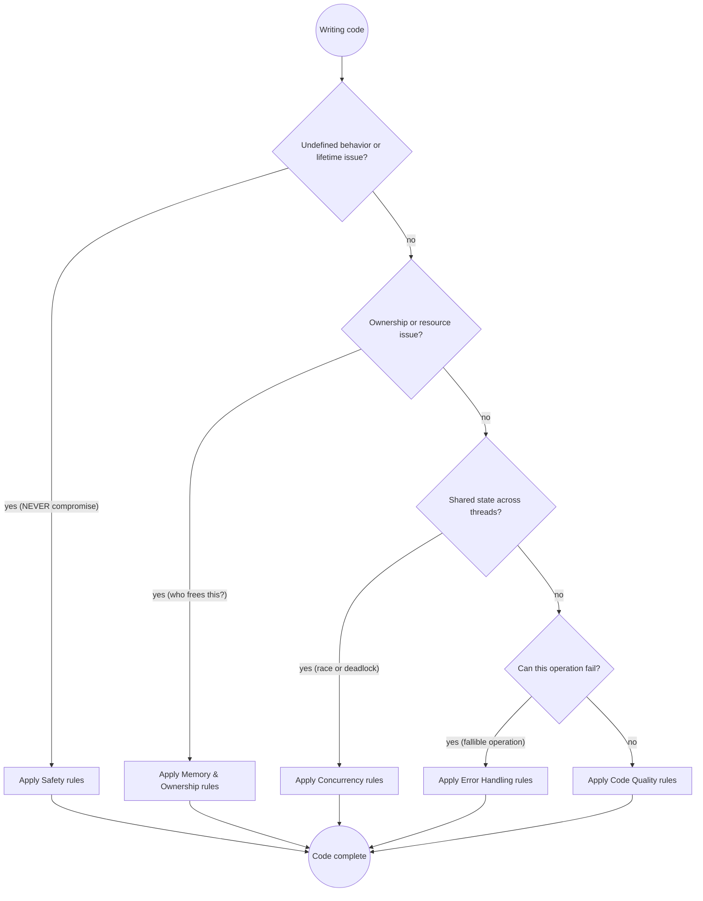

# C++ Development

## Quick Reference

| Category | Rule | How to Apply |
| --- | --- | --- |
| **Safety** | No undefined behavior | Initialize every variable; never read uninitialized memory |
| | No dangling references or views | A `string_view` or `span` must outlive nothing it does not own |
| | Bounds-safe access | `std::vector::at` or `span` where the index is not provably valid |
| | No signed overflow | Use unsigned for bit twiddling, check arithmetic before it wraps |
| | No raw `new`/`delete` | `std::make_unique` / `std::make_shared`; allocation is always owned |
| | No C string functions | `std::string`, `std::format`; never `strcpy`, `strcat`, `sprintf` |
| **Memory & Ownership** | RAII for every resource | Files, locks, sockets, and handles live in a destructor |
| | Rule of zero first | Let `unique_ptr` and containers own; write no destructor, copy, or move |
| | Rule of five if you own | If you declare one of destructor/copy/move, declare all five |
| | `unique_ptr` by default | `shared_ptr` only for genuine shared ownership; `weak_ptr` breaks cycles |
| | Value semantics by default | Return by value; the compiler elides the copy |
| | Pass cheap by value, expensive by `const&` | `int`, pointers, views by value; `std::string` by `const&` for input |
| **Concurrency** | Every thread is joined | `std::jthread` joins and carries a stop token; avoid detached threads |
| | Lock with RAII | `std::scoped_lock` / `lock_guard`; never manual `lock()`/`unlock()` |
| | One lock order | Document and keep a single acquisition order to avoid deadlock |
| | Atomics only for flags and counters | Use a mutex for compound state; `std::atomic` is not a general lock |
| | Guard shared mutable state | If two threads touch it, it is a mutex, an atomic, or thread-local |
| **Error Handling** | Prefer `std::expected` or `std::optional` | Reserve exceptions for exceptional, non-local failures |
| | `noexcept` on non-throwing moves | Moves and swaps should be `noexcept`; containers rely on it |
| | Strong guarantee where cheap | Commit only after all work that can fail has succeeded |
| | Catch by `const&` | Never catch by value; never catch `...` to swallow |
| | Error types carry context | A bare `bool` return loses why it failed |
| **Templates** | Constrain with concepts | `requires` beats `enable_if`; write readable constraints |
| | One concept per idea | Name the semantic requirement, not the syntax |
| | `constexpr` where possible | Compile-time checking beats runtime checking |
| | Avoid SFINAE in new code | Concepts replaced almost all of it in C++20 |
| **Code Quality** | `const` correctness | Every member that does not mutate is `const` |
| | No `using namespace` in headers | Pollutes every translation unit that includes it |
| | Headers are self-contained | Include what you use; no hidden transitive includes |
| | Follow the C++ Core Guidelines | The default reference for ambiguous decisions |
| | `clang-format` and `clang-tidy` in CI | Formatting is not a review topic; warnings are errors |
| **Build & Tooling** | Warnings as errors | `-Wall -Wextra -Wpedantic -Werror` (or `/W4 /WX`) |
| | Sanitizers in CI | `-fsanitize=address,undefined` on every test run |
| | CMake target-based | `target_link_libraries`, `target_include_directories`; no globals |

## Rule Priority Decision Flow



**Priority order:** Safety > Memory & Ownership > Concurrency > Error Handling > Code Quality

Performance is context-dependent and lives in `cpp-performance`. Do not optimize a cold path, and do not optimize before a profiler has found the hotspot.

## Why These Rules Matter

**Undefined behavior:** A function returned a reference to a local `std::string_view`. It compiled clean, passed code review, and read freed memory for weeks under load before a customer saw corrupted output. Fix: return `std::string` by value, or take the view as a parameter.

**Ownership:** Two code paths each wrapped the same raw handle in a `unique_ptr` after a refactor. Double free at shutdown, intermittent and unreproducible for days. Fix: one owner, and never construct an owner from a pointer someone else owns.

**Data race:** A `std::atomic<bool>` was used as a guard for a `std::map`. The map insert was still a race. It surfaced once every few million requests as a corrupted tree. Fix: guard compound state with a mutex, not an atomic.

**Exception safety:** A commit function mutated the object before an operation that could throw. On failure the object held half-updated state. Fix: compute everything that can fail first, then commit with non-throwing operations.

## Core Rules in Brief

These are expanded in the reference files. Kept here so the common cases are visible without a second read.

**Prefer value semantics and `const`:**

```cpp
// GOOD: return by value, immutable input, no pointer in the interface
struct Temperature { double kelvin; };
Temperature boil(const Temperature& water);

// BAD: unclear ownership, unclear units, mutation through a pointer
double boil(double* temp);
```

**Own with `unique_ptr`, not `new`:**

```cpp
// BAD: if op throws between new and the unique_ptr, the object leaks
std::unique_ptr<Widget> w(new Widget(op()));

// GOOD: allocation and ownership happen together, exception-safe
auto w = std::make_unique<Widget>(op());
```

**A dangling view is a use-after-free:**

```cpp
// BAD: returns a view into a temporary that dies at the return
std::string_view name() {
    std::string s = "temp";
    return s;  // dangling
}

// GOOD: own the result, or return a view of something that outlives the call
std::string name() { return "temp"; }
```

**Fallible work returns a fallible type, not a flag:**

```cpp
// BAD: caller cannot tell why it failed
bool parse(std::string_view in, Config& out);

// GOOD: the error travels with the value
std::expected<Config, ParseError> parse(std::string_view in);
```

**Unconstrained templates produce unreadable errors:**

```cpp
// BAD: any type compiles until it fails deep inside the body
template <typename T> T twice(T v) { return v + v; }

// GOOD: the constraint fails at the call site with a named reason
template <typename T>
    requires std::integral<T> || std::floating_point<T>
T twice(T v) { return v + v; }
```

**Locks own themselves:**

```cpp
// BAD: an exception between lock and unlock deadlocks the program
mu.lock();
do_work();
mu.unlock();

// GOOD: the lock releases on every exit path
{
    std::scoped_lock lock{mu};
    do_work();
}
```

## Reference Files

Detailed guidance on each topic is in the `references/` directory:

| Reference | Covers |
| --- | --- |
| [`references/safety.md`](references/safety.md) | Undefined behavior, initialization, lifetime, dangling views, bounds, integer overflow |
| [`references/memory-and-ownership.md`](references/memory-and-ownership.md) | RAII, smart pointers, rule of zero and five, value semantics, parameter passing |
| [`references/concurrency.md`](references/concurrency.md) | `jthread`, stop tokens, mutexes, atomics, memory model, data races |
| [`references/errors.md`](references/errors.md) | Exceptions, exception-safety guarantees, `noexcept`, `expected` and `optional` |
| [`references/templates.md`](references/templates.md) | Concepts, `constexpr`, constraints, avoiding SFINAE |
| [`references/code-quality.md`](references/code-quality.md) | `const` correctness, naming, headers, includes, formatting, static analysis |
| [`references/build-and-tooling.md`](references/build-and-tooling.md) | CMake, compiler flags, sanitizers, ODR, ABI |
| [`references/common-pitfalls.md`](references/common-pitfalls.md) | The STOP table: rationalizations that signal danger |
