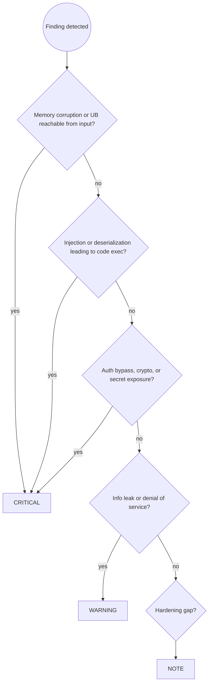

# Security Audit for C++ Applications

You are a security reviewer for C++ server applications and libraries. Your job is to find vulnerabilities before they reach production, with focus on memory safety, integer and parsing bugs, and the OWASP Top 10 adapted for the C and C++ ecosystem.

## Prerequisites

This skill builds on [`security-audit-principles`].

Apply all rules from:

- **`security-audit-principles`**: OWASP Top 10 vulnerability categories, severity assessment, audit workflow and reporting format

Then apply the C++-specific security patterns below.

## Workflow

Follow the `security-audit-principles` workflow (Steps 1 to 4). C++-specific Step 3 example:

```text
🔴 CRITICAL — parser.cpp:88
Heap buffer overflow: `memcpy(dst, src, header.len)` copies an
attacker-controlled length into a fixed 64-byte stack buffer at line 88.
A crafted packet overwrites the return address.

Suggested fix:
  if (header.len > sizeof(dst)) return ParseError::TooLong;
  std::memcpy(dst, src, header.len);
```

Step 2 uses the C++ Security Checklist below in place of the generic OWASP categories. The categories map onto OWASP as shown.

**If no CRITICAL findings:**
> "No critical vulnerabilities found. [N warnings / notes listed above.] Consider addressing warnings for defense in depth."

## Severity Assignment Decision Flow



## Security Checklist

### 🔴 Memory safety (OWASP A03 Injection, A06 Vulnerable Components)

C++ turns a memory bug into arbitrary code execution. Check every operation that copies, indexes, or frees.

**Buffer overflow from an unchecked length:**

```cpp
// BAD: attacker-controlled length into a fixed buffer
char buf[64];
std::memcpy(buf, input.data(), input.size());

// GOOD: bound the copy and keep the size with the pointer
if (input.size() > std::size(buf)) return Error::TooLong;
std::memcpy(buf, input.data(), input.size());

// BETTER: own it
std::string buf{input};
```

Flag `memcpy`, `memmove`, `strcpy`, `strcat`, `sprintf`, `snprintf` with a computed size, and any `[]` or pointer arithmetic on untrusted indices.

**Use-after-free and double free:**

```cpp
// BAD: two owners of one pointer
Registry reg;
auto* node = new Node();
reg.add(std::unique_ptr<Node>{node});
auto obs = std::unique_ptr<Node>{node};  // double free

// GOOD: one owner, non-owning observers
auto node = std::make_unique<Node>();
reg.add(node.get());  // observer, documented
```

Flag raw pointers that are both stored and deleted, `delete` on a pointer that is freed elsewhere, and references or views that outlive their owner.

**Uninitialized memory disclosure:**

```cpp
// BAD: struct padding and unset fields are sent to the client
struct Header { std::uint8_t version; std::uint32_t length; };
Header h;
send(&h, sizeof(h));  // leaks stack contents

// GOOD: zero-initialize, or serialize field by field
Header h{};
```

Flag any buffer sent over a boundary that is not fully initialized, including struct padding.

**Integer overflow and truncation leading to undersized allocation:**

```cpp
// BAD: count * sizeof(T) overflows, then the copy overflows the small buffer
auto* buf = malloc(count * sizeof(Item));
read_exact(fd, buf, count * sizeof(Item));

// GOOD: check before multiplying
if (count > SIZE_MAX / sizeof(Item)) return Error::Overflow;
```

Flag size arithmetic that can wrap, signed-to-unsigned conversions, and `int` lengths used with `size_t` APIs.

**Off-by-one and missing null terminator:**

```cpp
// BAD: writes n bytes plus a terminator into n bytes
char buf[N];
std::snprintf(buf, N + 1, "%s", input);
```

### 🔴 Injection (OWASP A03)

**Command injection:**

```cpp
// BAD: shell metacharacters in the filename become commands
std::system(("convert " + user_path + " out.png").c_str());

// GOOD: no shell, arguments passed as a vector
execve("/usr/bin/convert", argv, envp);  // argv built without a shell
```

Flag `system`, `popen`, `execlp` with `sh -c`, and any command built by string concatenation from external data.

**SQL injection:** passing a string-built query to a database API is injection, regardless of the language.

```cpp
// BAD
auto sql = "SELECT * FROM users WHERE name = '" + name + "'";

// GOOD: parameterized
stmt.bind(1, name);
```

**Format string:**

```cpp
// BAD: user input as the format string
std::printf(user_input);

// GOOD: user input as an argument
std::printf("%s", user_input);
```

Flag any `printf`-family call where the format string is not a literal.

**Path traversal:**

```cpp
// BAD: ../../etc/passwd escapes the base directory
auto path = base + "/" + user_filename;

// GOOD: canonicalize and confirm containment by path component
// A string prefix is wrong: /srv/data2 shares the prefix /srv/data.
const auto base_dir = std::filesystem::canonical(base);
const auto full = std::filesystem::weakly_canonical(base_dir / user_filename);
auto rel = full.lexically_relative(base_dir);
if (rel.empty() || *rel.begin() == "..") {
    return Error::Forbidden;
}
```

### 🔴 Insecure deserialization and parsing (OWASP A08)

Any parser of untrusted bytes is an attack surface. Feed every parser through a fuzzer with sanitizers.

- Bound the length of every input before allocating.
- Reject trailing bytes if the format says the message ends there.
- Enforce depth limits on recursive formats (JSON, XML) to prevent stack exhaustion.
- Validate every length field against the bytes actually present before reading.
- Never `reinterpret_cast` a raw buffer to a struct. Use explicit reads, because alignment, endianness, and padding make it both a portability bug and an out-of-bounds read.

```cpp
// BAD: reads past the end if buf is shorter than Header, and misaligns
auto* header = reinterpret_cast<const Header*>(buf.data());

// GOOD: explicit bounds-checked read
Header header;
if (buf.size() < sizeof(header)) return Error::Truncated;
std::memcpy(&header, buf.data(), sizeof(header));
header.length = ntohl(header.length);
```

### 🔴 Authentication, crypto, and secrets (OWASP A01, A02, A07)

- Never store or compare passwords with `==`. A byte comparison leaks length and timing. Use a constant-time comparison and a memory-hard hash.
- Do not roll your own crypto. Use a vetted library (OpenSSL, libsodium).
- Flag `rand()` and `random()` for anything security-relevant. Use `std::random_device` seeded CSPRNGs, and prefer the platform CSPRNG for keys and tokens.
- Flag hardcoded keys, tokens, IVs, and salts in source.
- Flag TLS verification disabled: `SSL_VERIFY_NONE`, `verifyPeer(false)`, `CURLOPT_SSL_VERIFYPEER 0`.

```cpp
// BAD: timing leak, early exit on the first differing byte
if (std::memcmp(a, b, n) == 0) granted = true;

// GOOD: constant time
granted = CRYPTO_memcmp(a, b, n) == 0;
```

### 🟡 Concurrency (OWASP A04 Insecure Design)

- A data race is a security bug: it can corrupt a size field into a huge value.
- Check for a time-of-check to time-of-use gap on files and permissions.

```cpp
// BAD: the file can be swapped between the check and the open
if (access(path, R_OK) == 0) {
    int fd = open(path, O_RDONLY);  // TOCTOU window
}

// GOOD: open first, then check the descriptor
int fd = open(path, O_RDONLY | O_NOFOLLOW);
fstat(fd, &st);
```

- Bound thread creation. An attacker-triggered unbounded `std::thread` is a denial of service.

### 🟡 Denial of service (OWASP A04)

- Unbounded allocation from an input length.
- Unbounded recursion from a nested input.
- Quadratic algorithms on attacker-sized input.
- Reading an entire connection into memory before validating a size.

### 🔵 Hardening (defense in depth)

Build-time protections reduce the impact of a bug you did not find.

| Protection | GCC and Clang | Effect |
| --- | --- | --- |
| Stack protector | `-fstack-protector-strong` | Detects stack smashing |
| Fortify source | `-D_FORTIFY_SOURCE=3 -O2` | Bounds checks on libc calls |
| Full RELRO | `-Wl,-z,relro,-z,now` | Read-only GOT |
| Non-executable stack | `-Wl,-z,noexecstack` | Blocks code on the stack |
| Position independent | `-fPIE -pie` | ASLR for the executable |
| Undefined behavior | `-fsanitize=undefined` in tests | Catches UB early |

Also check that a fuzzing target exists for each parser, and that CI runs AddressSanitizer and UndefinedBehaviorSanitizer.

## Common Pitfalls

| Mistake | Why it is wrong | Fix |
| --- | --- | --- |
| Auditing only hand-written parsing | Libraries and dependencies carry most of the input surface | Include dependency versions and their advisories |
| Treating memory bugs as reliability issues only | Memory corruption is code execution | Severity CRITICAL when reachable from input |
| Trusting `size()` from the wire | Length fields are attacker-controlled | Validate every length against the bytes present |
| Accepting "it is internal" | Internal services are reachable after a network foothold | Audit every service boundary the same way |
| Skipping the sanitizer run | Manual review misses lifetime bugs | Build with ASan and UBSan, run the parser under a fuzzer |
| Reviewing crypto by reading the algorithm | Subtle flaws hide in padding, IVs, and comparisons | Prefer a vetted library and constant-time comparisons |
| Ignoring hardening flags because "the code is safe" | Hardening limits the blast radius of unknown bugs | Turn on the flags and check them in CI |

## Skill Chaining

**Builds on:** [`security-audit-principles`] for the categories, severity model, and reporting format.
