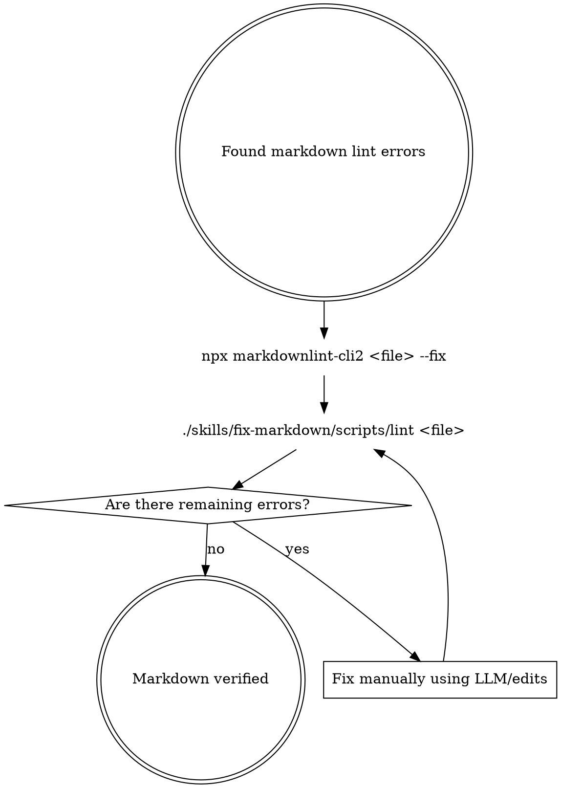

# Fix Markdown

## Overview

A workflow to efficiently fix Markdown styling and formatting errors. It uses
the automated `--fix` capability of `markdownlint-cli2` to resolve formatting
issues first, then guides the agent on how to surgically edit remaining
structural errors.

## When to Use

Use when:

- The user explicitly requests to fix markdown formatting errors or run
  markdownlint-cli2.

When NOT to use:

- The file is not a Markdown file (`.md`).
- You need to write new content or rewrite the text for tone, rather than
  fixing styling/formatting errors.

## Workflow



## Quick Reference

| Command | Purpose |
| --- | --- |
| `npx markdownlint-cli2 "<file>" --fix` | Resolve formatting errors |
| `./skills/fix-markdown/scripts/lint "<file>"` | Report errors |

## Implementation

### Step 1: Run Auto-Fix

Always run the automated `--fix` command first. This fixes many common issues
(like trailing spaces, consecutive blank lines, missing end-of-file newlines,
or trailing punctuation in headers) automatically.

```bash
npx markdownlint-cli2 "<file>" --fix
```

### Step 2: Check Remaining Errors

Run the wrapper script to see what errors cannot be automatically fixed:

```bash
./skills/fix-markdown/scripts/lint "<file>"
```

### Step 3: Fix Remaining Errors

For any remaining errors, fix them manually using code editing tools:

- **MD024/no-duplicate-heading**: Ensure headings at the same level have
  unique text.
- **MD029/ol-prefix**: Fix ordered list prefixes to use consistent ordering,
  typically sequential (`1.`, `2.`, `3.`).
- **MD060/table-column-style**: Ensure consistent spacing around table pipes
  (e.g., `| --- | --- |` instead of `|---|---|`).

### Step 4: Verify

Re-run the wrapper script to verify that no errors remain (exits with code 0):

```bash
./skills/fix-markdown/scripts/lint "<file>"
```

## Common Mistakes

- **Manually fixing autofixable errors**: Editing trailing whitespace or blank
  lines by hand, which is highly inefficient and prone to secondary errors. Run
  `--fix` first!
