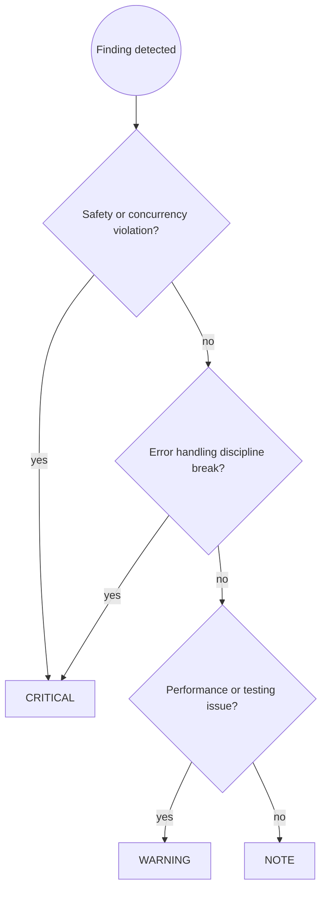

# Go Code Review

You are an expert Go code reviewer. Your job is to catch problems before they reach the repository, with particular focus on safety violations, error handling discipline, and concurrency correctness — the issues most likely to cause silent production failures in Go codebases.

## Prerequisites

**This skill builds on [`code-review-principles`] and [`golang-dev`]**.

Apply all rules from:
- **`code-review-principles`**: Severity assignment (CRITICAL/WARNING/NOTE), review workflow and reporting format
- **`golang-dev`**: Safety patterns (nil maps, error checking, context discipline), error handling (wrapping, Is/As, single handling rule), concurrency (goroutine lifecycle, errgroup, channel discipline), code quality (formatting, interfaces, packages), performance (preallocation, profiling)

Then apply the Go-specific review patterns below.

## Workflow

Follow the `code-review-principles` workflow (Steps 1–4). Go-specific Step 3 example:

```
🔴 CRITICAL — user_service.go:42
Error discarded with `_`: `db.Save(user)` on line 42 discards the error.
If the save fails, the caller receives no indication — the operation
appears to succeed when it did not.

Suggested fix:
  err := db.Save(user)
  if err != nil {
      return fmt.Errorf("save user %s: %w", user.ID, err)
  }
```

**Step 4:** re-run `/golang-code-review` after fixes. Only report completion after the user confirms all issues are resolved.

Step 2 uses the Go Review Checklist below.

---

## Severity Assignment Decision Flow



---

## Review Checklist

### 🔴 Safety (always check — any violation is CRITICAL)

**Error discarded with `_` — error is silently swallowed:**
```go
// ❌ BAD: Error ignored; caller sees success regardless
result, _ := db.Query(ctx, query)

// ✅ GOOD: Error handled or propagated
result, err := db.Query(ctx, query)
if err != nil {
    return fmt.Errorf("query: %w", err)
}
```

The only acceptable case is `_ = f.Close()` (or `defer f.Close()`) for best-effort cleanup where the real error happened before close. Flag every other discard.

**Nil map/slice write — panics at runtime:**
```go
// ❌ BAD: Nil map panics on write
var m map[string]int
m["key"] = 1

// ✅ GOOD: Initialize before use
m := make(map[string]int)
m["key"] = 1
```

Flag any `var m map[K]V` or `var s []T` where the next use is a write (map assignment, `append`, or index assignment).

**Missing `defer` for resource cleanup:**
```go
// ❌ BAD: Close far from open; easy to miss on early return
f, err := os.Open(path)
if err != nil {
    return err
}
// ... code that might return early ...
f.Close()

// ✅ GOOD: Defer immediately after successful open
f, err := os.Open(path)
if err != nil {
    return err
}
defer f.Close()
```

Flag any resource acquisition (file open, `Lock()`, `sql.Open`, context with `cancel`) that does not pair with an immediate `defer`.

**Context cancellation not checked in blocking operations:**
```go
// ❌ BAD: select without ctx.Done — goroutine leaks on cancellation
for {
    select {
    case msg := <-ch:
        handle(msg)
    }
}

// ✅ GOOD: ctx.Done allows clean shutdown
for {
    select {
    case <-ctx.Done():
        return ctx.Err()
    case msg := <-ch:
        handle(msg)
    }
}
```

Flag any goroutine-spawning `select` that omits `<-ctx.Done()`.

### 🔴 Concurrency (CRITICAL)

**Loop variable capture in goroutines (Go <1.22):**
```go
// ❌ BAD: All goroutines see the final value of url
for _, url := range urls {
    go func() {
        fetch(url)
    }()
}

// ✅ GOOD: Capture by copy
for _, url := range urls {
    url := url
    go func() {
        fetch(url)
    }()
}
```

Flag any goroutine or closure created inside a `for` loop (Go <1.22) that references the loop variable.

**`context.Context` stored in a struct:**
```go
// ❌ BAD: ctx loses cancellation scope; one operation can cancel another
type Request struct {
    ctx context.Context
    id  string
}

// ✅ GOOD: ctx is passed as first param
func HandleRequest(ctx context.Context, id string) error { ... }
```

Flag any struct field of type `context.Context`.

**Mutex passed by value (copied):**
```go
// ❌ BAD: Embedded sync.Mutex is copied with the struct — race condition
type Counter struct {
    sync.Mutex
    val int
}

// ✅ GOOD: Named field, or embed as *sync.Mutex
type Counter struct {
    mu   sync.Mutex
    val int
}
```

Flag any `sync.Mutex`, `sync.RWMutex`, or `sync.WaitGroup` embedded without a pointer or named field.

**Goroutine without lifecycle management:**
```go
// ❌ BAD: No mechanism to stop or await the goroutine
go poll(ctx)

// ✅ GOOD: Track with WaitGroup or errgroup
g, ctx := errgroup.WithContext(ctx)
g.Go(func() error { return poll(ctx) })
```

Flag any bare `go` call where the goroutine's completion is not tracked by `sync.WaitGroup`, `errgroup`, or channel.

### 🔴 Error Handling (CRITICAL)

**Errors concatenated instead of wrapped — chain is broken:**
```go
// ❌ BAD: %v or + breaks the chain; errors.Is cannot inspect
return fmt.Errorf("save: %v", err)
return errors.New("save: " + err.Error())

// ✅ GOOD: %w preserves the chain
return fmt.Errorf("save user %s: %w", id, err)
```

Flag any `fmt.Errorf` with `%v` or string concatenation on an error argument.

**Log-and-return — duplicate in log aggregator:**
```go
// ❌ BAD: Logged at call site AND returned to caller who logs again
log.Error("failed to process order", "err", err)
return fmt.Errorf("process order: %w", err)

// ✅ GOOD: Either log (at boundary) OR return (internally)
// Internal — propagate:
return fmt.Errorf("process order %s: %w", id, err)
// Boundary — log and return user-friendly:
log.Error("process order failed", "id", id, "err", err)
return ErrInternal
```

Flag any `if err != nil` block that both logs and returns the same error.

**`panic` for expected error conditions:**
```go
// ❌ BAD: Expected validation failure kills the process
if input == "" {
    panic("input cannot be empty")
}

// ✅ GOOD: Return error; caller decides severity
if input == "" {
    return errors.New("input cannot be empty")
}
```

Flag any `panic` that guards against expected input or runtime conditions (reserve panic for impossible invariants).

**`%w` internally, `%v` at system boundaries — chain exposure control:**
```go
// ❌ BAD: %w at system boundary leaks internal chain to external caller
return fmt.Errorf("save user %s: %w", id, err)
// External caller now sees "save user 42: connection refused: dial tcp ..."

// ✅ GOOD: %w internally, %v at boundary
// Internal:
return fmt.Errorf("save user %s: %w", id, err)
// Boundary (HTTP handler, CLI): log the chain, return user-friendly:
log.Error("save failed", "id", id, "err", err)
return fmt.Errorf("save failed: %v", err)
```

Flag `%w` in errors returned at system boundaries (HTTP handlers, CLI commands, API responses). Internally `%w` is correct — it enables `errors.Is`/`errors.As` up the call stack. At the boundary, `%v` prevents leaking implementation details to external consumers.

****Unstructured logging (`fmt.Println`, `log.Printf`) in new code:**
```go
// ❌ BAD: Unstructured — no levels, no attributes, grep-only search
log.Printf("failed to process order %s: %v", id, err)

// ✅ GOOD: Structured — level, message template, key-value attributes
slog.Error("failed to process order",
    "order_id", id,
    "error", err,
)
```

Flag any new usage of `log.Printf`, `fmt.Println`, or `log.Fatalf` for error logging. Go 1.21+ ships `log/slog` as the standard structured logger — use it.

**Multiple independent errors collapsed** to one — losing information:**
```go
// ❌ BAD: Only the last error survives; earlier failures are lost
var result *Result
for _, item := range items {
    r, err := process(item)
    if err != nil {
        return nil, fmt.Errorf("process item %d: %w", i, err)
    }
    result = r
}

// ✅ GOOD: errors.Join preserves all errors (Go 1.20+)
var errs error
for i, item := range items {
    r, err := process(item)
    if err != nil {
        errs = errors.Join(errs, fmt.Errorf("process item %d: %w", i, err))
        continue
    }
    result = r
}
return result, errs
```

Flag any loop where an error causes an early return but earlier iterations may also have failed. Use `errors.Join` in validation, batch processing, and fan-out patterns where independent operations each produce their own error.

**Direct error comparison on wrapped errors:****
```go
// ❌ BAD: Fails when err has been wrapped
if err == sql.ErrNoRows { ... }

// ✅ GOOD: Unwraps the chain
if errors.Is(err, sql.ErrNoRows) { ... }
```

Flag any `==` comparison of an error value that may have passed through `fmt.Errorf(...%w...)`.

### 🟡 Code Quality (WARNING)

**Unnecessary `else` after `return`/`break`/`continue`:**
```go
// ❌ BAD: else is dead code — the if body always returns
if err != nil {
    return err
} else {
    process()
}

// ✅ GOOD: Early return, happy path unindented
if err != nil {
    return err
}
process()
```

**Complex condition with 3+ operands — intent is hidden:**
```go
// ❌ BAD: Wall of || — reader must parse the full expression to understand intent
if user.Role == RoleAdmin || resource.OwnerID == user.ID || (resource.IsPublic && user.IsVerified) || permissions.Contains(PermOverride) {
    allow()
}

// ✅ GOOD: Named booleans make the business logic explicit
isAdmin := user.Role == RoleAdmin
isOwner := resource.OwnerID == user.ID
isPublicVerified := resource.IsPublic && user.IsVerified
if isAdmin || isOwner || isPublicVerified || permissions.Contains(PermOverride) {
    allow()
}
```

Flag any `if` condition with 3+ `||` or `&&` operands. Extract each clause into a named boolean.

**Naked returns in functions longer than ~3 lines:****
```go
// ❌ BAD: Unclear what values are returned
func parse(data []byte) (id string, err error) {
    // ... 15 lines ...
    return  // What is being returned?
}

// ✅ GOOD: Explicit returns clarify intent
func parse(data []byte) (id string, err error) {
    // ... 15 lines ...
    return id, nil
}
```

**Value receiver on a type that requires a pointer receiver:**
```go
// ❌ BAD: Value receiver — Inc() mutates a copy, caller's counter unchanged
type Counter struct { mu sync.Mutex; n int }
func (c Counter) Inc() { c.mu.Lock(); c.n++; c.mu.Unlock() }

// ✅ GOOD: Pointer receiver — mutates the caller's Counter
func (c *Counter) Inc() { c.mu.Lock(); c.n++; c.mu.Unlock() }

// ❌ BAD: Value receiver on large struct (~128+ bytes) — copies on every call
func (u User) FullName() string { return u.First + " " + u.Last }

// ✅ GOOD: Pointer receiver avoids copy
func (u *User) FullName() string { return u.First + " " + u.Last }
```

Flag value receivers on types that embed `sync.Mutex`/`sync.RWMutex`/`sync.WaitGroup`, on large structs, or where the method mutates the receiver.

**Package-level mutable state:****
```go
// ❌ BAD: Global state — untestable, races across tests
var db *sql.DB
func init() {
    db, _ = sql.Open("postgres", os.Getenv("DATABASE_URL"))
}

// ✅ GOOD: Dependency injection
type Server struct{ db *sql.DB }
func NewServer(db *sql.DB) *Server { ... }
```

**Interface defined in the producer package (where the concrete type lives):**
```go
// ❌ BAD: Consumer dependency on producer's interface definition
// producer/ defines both interface and implementation

// ✅ GOOD: Consumer defines the interface it needs; producer returns concrete types
```

### 🟡 Testing (WARNING)

**`go vet` not run in CI or test workflow:**
```bash
# ❌ Missing: go vet ./...
# ✅ Required:
go vet ./...
```

`go vet` catches misformatted `%` verbs, unreachable code, bad `sync` calls, and other statically-detectable bugs. Run it alongside tests in CI. Flag its absence in any PR that adds significant new code.

**No race detector run on test files with goroutines:****
```go
// ❌ Missing: go test -race ./...
```

Flag any PR with goroutine usage where the review diff does not show the race detector being used.

**Missing table-driven test for repeated assertion patterns:**
```go
// ❌ BAD: Copy-pasted test bodies — hard to extend
func TestAdd_positive(t *testing.T) {
    if Add(2, 3) != 5 { t.Error("...") }
}
func TestAdd_negative(t *testing.T) {
    if Add(-1, -2) != -3 { t.Error("...") }
}

// ✅ GOOD: Table-driven — one source of truth for all cases
func TestAdd(t *testing.T) {
    tests := []struct{ a, b, want int }{...}
    for _, tt := range tests {
        got := Add(tt.a, tt.b)
        if got != tt.want {
            t.Errorf("Add(%d,%d)=%d; want %d", tt.a, tt.b, got, tt.want)
        }
    }
}
```

### 🟡 Performance (WARNING in hot paths, NOTE elsewhere)

**No preallocation when capacity is known:**
```go
// ❌ BAD: Grows backing array multiple times
var ids []string
for _, u := range users {
    ids = append(ids, u.ID)
}

// ✅ GOOD: Single allocation
ids := make([]string, 0, len(users))
```

**String concatenation with `+` in a loop:**
```go
// ❌ BAD: O(n²) — each iteration allocates a new string
var result string
for _, s := range parts {
    result += s
}

// ✅ GOOD: strings.Builder or strings.Join
var sb strings.Builder
for _, s := range parts {
    sb.WriteString(s)
}
```

**Default `http.Client` without Transport config:**
```go
// ❌ BAD: MaxIdleConnsPerHost defaults to 2 — bottleneck under concurrency
resp, err := http.DefaultClient.Do(req)

// ✅ GOOD: Tuned transport
transport := &http.Transport{
    MaxIdleConns:        100,
    MaxIdleConnsPerHost: 10,
    IdleConnTimeout:     90 * time.Second,
}
client := &http.Client{Transport: transport}
```

### 🔵 Code Clarity (NOTE)

- Blank import (`_ "pkg"`) or dot import (`import . "pkg"`) outside `main`/`_test.go` — blank imports register side effects that should be visible at the application root, dot imports hide name provenance
- `context.Context` not first parameter in function signatures
- Comment explains *what* instead of *why* — especially for non-obvious workarounds or performance tricks
- Large interface (>3 methods) where smaller interfaces would suffice
- Composite literal without field names (`&Foo{"a", 1}` — breaks on field reorder)
- Unexported names that are never used within the package (dead code)

---

## Common Pitfalls

| Mistake | Why It's Wrong | Fix |
|---------|----------------|------|
| Only running the code to verify it works | Runtime testing misses nil map panics, goroutine leaks, and race conditions that only surface under specific timing | Run `go test -race ./...`; static analysis catches what runtime testing misses |
| Approving unwrapped errors as "fine for now" | Stripped error chains make production debugging guesswork — caller cannot `errors.Is` or `errors.As` through a `%v` break | Require `fmt.Errorf("context: %w", err)` for every propagated error |
| Accepting `any` / `interface{}` as "temporary" | Temporary `any` is permanent `any` — type safety lost for all callers | Require generics, concrete types, or well-defined interfaces at review time |
| Letting `panic` through for validation logic | panic crashes the process; a single bad request takes down all in-flight requests | Require error returns; `panic` only for truly unrecoverable states |
| Ignoring missing race detector in test output | Without `-race`, data races silently corrupt memory; symptoms appear in production | Require `go test -race ./...` as part of the test command |
| Over-focusing on performance in cold paths | Premature optimization adds complexity where it doesn't matter | Focus perf review on actual hot paths identified by profiling |

---

## Skill Chaining

**Builds on:** [`code-review-principles`] for severity model and reporting format, [`golang-dev`] for Go-specific rules and patterns
