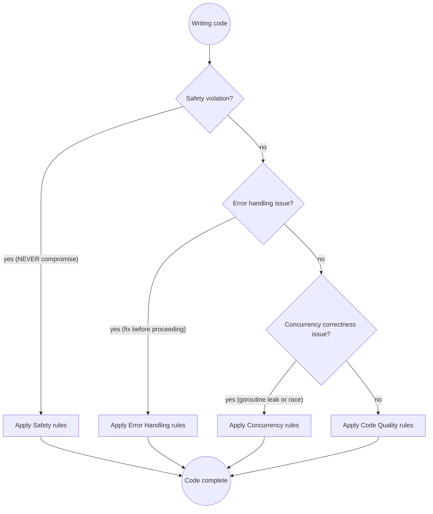

# Go Development

## Quick Reference

| Category | Rule | How to Apply |
| --- | --- | --- |
| **Safety** | Never write to nil maps/slices | Initialize with `make()` or composite literal |
| | Always check errors | Handle or propagate; never discard with `_` |
| | Context as first parameter | `ctx context.Context` is always the first function param |
| | Defer for resource cleanup | `defer f.Close()`, `defer cancel()`, `defer db.Close()` |
| | No goroutine leaks | Every goroutine must have a bounded lifecycle |
| **Error Handling** | Wrap errors with context | `fmt.Errorf("doing x: %w", err)` — never `+` or `%v` |
| | Inspect with `errors.Is`/`errors.As` | Chain inspection, never direct `==` on wrapped errors |
| | Error strings lowercase, no punctuation | `errors.New("file not found")` not `errors.New("File not found!")` |
| | Single handling rule | Log XOR return, never both |
| | Panic only for truly unrecoverable | Not for expected errors — use error returns |
| | Sentinel errors for expected failures | `var ErrX = errors.New(...)` — callers match with `errors.Is` |
| **Concurrency** | Propagate context everywhere | First param, threaded through all blocking calls |
| | Capture loop variables | `i := i` or use Go 1.22+ loop var semantics |
| | Use `errgroup` for coordinated work | Cancels siblings on first error |
| | Buffered channels sized to consumer count | Prevents goroutine blocks on send |
| | Beware of `mu` value copying | Pass mutexes as pointers; `defer mu.Unlock()` immediately |
| **Testing** | Table-driven tests with subtests | `tests := []struct{...}` + `t.Run()` |
| | Use `t.Helper()` in helpers | Removes helper from failure line trace |
| | Use `t.Cleanup()` for teardown | Scoped cleanup, runs even on panic |
| | Prefer `httptest` for HTTP handlers | `httptest.NewRequest` + `httptest.NewRecorder` |
| | Golden files in `testdata/` | Flag-gated with `-update` |
| | Run with `-race` | `go test -race ./...` — mandatory before commit |
| **Code Quality** | `gofmt` / `gofumpt` before every commit | Non-negotiable formatting; enforce in CI |
| | One primary type per file | When it has significant methods |
| | Accept interfaces, return structs | Consumer defines the interface; producer returns concrete |
| | Keep interfaces small (1-3 methods) | Small interfaces are easy to implement and compose |
| | Unexport aggressively | Exporting is a commitment; unexporting is breaking |
| | Short functions, one job | Extract until functions fit on one screen |
| | Early return, reduce nesting | Errors/edge cases first; happy path stays flat and unindented |
| | Make the zero value useful | Types work without explicit `New*` constructor; prefer zero-value readiness |
| | Functional options for optional config | Replaces 4+ params with composable `type Option func(*T)` |
| | Value vs pointer receiver deliberately | Pointer for mutation/large types; value for small immutable scalars |
| | `:=` for values, `var` for zero intent | `:=` signals non-zero; `var` signals "starts at zero" |
| | No magic numbers — use named constants | Every bare literal (except 0, 1, -1) needs a `const` name |
| **Design** | Graceful shutdown with signal.Notify | Catch SIGINT/SIGTERM; `server.Shutdown(ctx)` drains connections |
| | Inject dependencies explicitly | Pass via constructor; avoid `var db *sql.DB` globals |
| **Performance** | Profile before optimizing | pprof finds hot spots; intuition is wrong ~80% of the time |
| | Preallocate slices of known size | `make([]T, 0, n)` avoids repeated growth + copy |
| | `strings.Builder` over `+` in loops | Single allocation vs O(n²) copying |
| | `sync.Pool` for hot allocations | Reduces GC pressure on frequently-allocated objects |
| | Set `GOMEMLIMIT` in containers | 80-90% of container memory to prevent OOM kills |

## Rule Priority Decision Flow



**Priority order:** Safety > Error Handling > Concurrency > Code Quality

Testing and Performance are context-dependent — apply testing rules when writing/adding tests, apply performance rules when a profiler has identified a bottleneck.

## Safety

Go's type system and compiler catch many mistakes, but nil maps, discarded errors, and unbounded goroutines slip through to runtime.

**Never write to nil maps or slices:**

```go
// ❌ BAD: Nil map panics on write
var m map[string]int
m["key"] = 1  // panic: assignment to entry in nil map

// ✅ GOOD: Initialize with make or literal
m := make(map[string]int)
m["key"] = 1

// ✅ GOOD: Composite literal for known values
m := map[string]int{"key": 1}
```

Nil slices don't panic on `append` (it allocates), but they serialize to `null` in JSON instead of `[]`, which surprises API consumers:

```go
// ❌ BAD: JSON output is {"items": null}
var items []string

// ✅ GOOD: JSON output is {"items": []}
items := []string{}
```

**Always check errors — never discard with `_`:**

```go
// ❌ BAD: Error silently discarded
result, _ := doSomething()

// ✅ GOOD: Handle or propagate
result, err := doSomething()
if err != nil {
    return fmt.Errorf("do something: %w", err)
}

// Acceptable: Best-effort cleanup, error logged elsewhere
_ = f.Close()
```

The `_` discard is justified only when the error is truly irrelevant — typically for deferred `Close()` calls where the real I/O error happened before cleanup.

**Context must always be the first parameter:**

```go
// ❌ BAD: Context buried in options struct
func Fetch(id string, opts *Options) (*Result, error)

// ✅ GOOD: Context is first parameter
func Fetch(ctx context.Context, id string, opts *Options) (*Result, error)
```

Never store `context.Context` in a struct — it prevents the context from scoping to a single operation and leaks the cancellation lifecycle.

**Defer for resource cleanup — pair allocation with defer:**

```go
// ❌ BAD: Close happens after 50 more lines; easy to miss
f, err := os.Open(filepath)
if err != nil {
    return err
}
// ... many lines ...
f.Close()

// ✅ GOOD: Defer immediately after successful open
f, err := os.Open(filepath)
if err != nil {
    return err
}
defer f.Close()
```

This applies to files, database connections, mutex locks, and context cancellations. Always pair the resource acquisition with its defer in the same few lines.

**Every goroutine must have a bounded lifecycle:**

```go
// ❌ BAD: Goroutine has no mechanism to stop
go func() {
    for {
        select {
        case msg := <-ch:
            handle(msg)
        }
    }
}()

// ✅ GOOD: Context cancellation controls goroutine lifetime
go func() {
    for {
        select {
        case <-ctx.Done():
            return
        case msg := <-ch:
            handle(msg)
        }
    }
}()
```

If a goroutine is spawned, the caller must be able to signal it to stop and must wait for it to finish. Use `sync.WaitGroup`, `errgroup`, or channel closure as your lifecycle primitives.

## Error Handling

Go treats errors as values, not exceptions. The discipline is explicit handling at every step.

**Always wrap errors with context:**

```go
// ❌ BAD: Stripped context — caller has no idea what failed
if err != nil {
    return err
}

// ❌ BAD: Concatenation breaks the error chain (can't errors.Is)
if err != nil {
    return fmt.Errorf("load config: %v", err)
}

// ✅ GOOD: %w preserves the chain for errors.Is/errors.As
if err != nil {
    return fmt.Errorf("load config %s: %w", path, err)
}
```

Wrap with business context: what operation failed and with what input. The pattern is `"doing x with y: %w"`.

**Use `errors.Is` and `errors.As` for chain inspection:**

```go
// ❌ BAD: Direct comparison fails on wrapped errors
if err == sql.ErrNoRows {
    return nil, ErrNotFound
}

// ✅ GOOD: errors.Is unwraps the chain
if errors.Is(err, sql.ErrNoRows) {
    return nil, ErrNotFound
}

// ✅ GOOD: errors.As extracts typed info from chain
var target *net.DNSError
if errors.As(err, &target) {
    log.Printf("DNS lookup failed for %s", target.Name)
}
```

**Error strings must be lowercase, no trailing punctuation:**

```go
// ❌ BAD
errors.New("File not found!")

// ✅ GOOD
errors.New("file not found")
```

This convention ensures error messages compose naturally when wrapped.

**Single handling rule: Log XOR Return, never both:**

```go
// ❌ BAD: Logged AND returned — duplicate in log aggregator
log.Error("failed to process order", "error", err)
return fmt.Errorf("process order: %w", err)

// ✅ GOOD: Log at boundary, return internally
// (internal function — caller handles)
if err != nil {
    return fmt.Errorf("process order %s: %w", orderID, err)
}

// ✅ GOOD: Log at boundary, return user-friendly message
// (HTTP handler — last stop in chain)
if err != nil {
    log.Error("failed to process order", "order_id", orderID, "error", err)
    http.Error(w, "internal server error", http.StatusInternalServerError)
    return
}
```

The rule: you either handle the error (log + user-facing response) or you propagate it. Doing both creates noisy, duplicated logs.

**Never use `panic` for expected error conditions:**

```go
// ❌ BAD: Panic for validation failure
if input == "" {
    panic("input cannot be empty")
}

// ✅ GOOD: Return error
if input == "" {
    return errors.New("input cannot be empty")
}
```

Reserve `panic` for truly unrecoverable states: impossible invariants, failed type assertions that must always succeed, or nil pointer dereferences in initialization.

**Use sentinel errors for expected failure kinds — let callers match with `errors.Is`:**

```go
// Define sentinels at the package level (exported if external code needs to match)
var (
    ErrNotFound     = errors.New("resource not found")
    ErrUnauthorized = errors.New("unauthorized")
    ErrInvalidInput = errors.New("invalid input")
)

func GetUser(id string) (*User, error) {
    if id == "" {
        return nil, ErrInvalidInput
    }
    // ...
    if err == sql.ErrNoRows {
        return nil, ErrNotFound
    }
    // ...
}

// Caller inspects with errors.Is — works even through %w chains
if errors.Is(err, store.ErrNotFound) {
    http.NotFound(w, r)
    return
}
```

Sentinels let callers distinguish error *kinds* without parsing strings. Keep them immutable (`errors.New`, not `fmt.Errorf`) so `errors.Is` works reliably. Use custom error types instead of sentinels when the error needs to carry dynamic data.

## Concurrency

Concurrency bugs are the hardest to reproduce and debug. Go's primitives are simple — the discipline is in how you combine them.

**Propagate context through the entire call chain:**

```go
func Handler(ctx context.Context, req Request) (*Response, error) {
    user, err := fetchUser(ctx, req.UserID)
    if err != nil {
        return nil, err
    }
    return buildResponse(ctx, user)
}

func fetchUser(ctx context.Context, id string) (*User, error) {
    return db.QueryUser(ctx, id)
}
```

Every blocking operation should accept a `context.Context` as its first parameter. This enables cancellation, timeouts, and deadine propagation from the top of the call stack to the bottom.

**Capture loop variables (Go <1.22) — or use Go 1.22+:**

```go
// ❌ BAD: All goroutines see the final value of url
for _, url := range urls {
    go func() {
        fetch(url)  // All fetch the last url
    }()
}

// ✅ GOOD: Capture by copy (Go <1.22)
for _, url := range urls {
    url := url
    go func() {
        fetch(url)
    }()
}

// ✅ GOOD: Go 1.22+ fixes loop var semantics
for _, url := range urls {
    go func() {
        fetch(url)  // Each goroutine gets its own url
    }()
}
```

The same bug applies to `for i := range` — any goroutine created inside the loop body that references the loop variable will see the wrong value.

**Use `errgroup` for coordinated goroutine work:**

```go
g, ctx := errgroup.WithContext(ctx)

for _, url := range urls {
    url := url
    g.Go(func() error {
        data, err := fetch(ctx, url)
        if err != nil {
            return fmt.Errorf("fetch %s: %w", url, err)
        }
        results = append(results, data)
        return nil
    })
}

if err := g.Wait(); err != nil {
    // First error from any goroutine; siblings are cancelled
    return nil, err
}
```

`errgroup.WithContext` creates a derived context that cancels when any goroutine returns an error. This prevents wasted work on the remaining goroutines.

**Use buffered channels sized to consumer count:**

```go
// ✅ GOOD: Buffered channel prevents send-side blocking
results := make(chan Result, len(jobs))

for _, j := range jobs {
    go func(j Job) {
        results <- process(j)
    }(j)
}
```

When a channel is unbuffered, the sender blocks until a receiver is ready. Buffered channels sized to the expected number of messages prevent goroutine deadlocks in fan-out patterns.

**Unlock mutexes immediately, never copy them:**

```go
// ❌ BAD: Unlock far from Lock; error in between panics
mu.Lock()
// ... 20 lines ...
mu.Unlock()

// ✅ GOOD: defer unlocks immediately
mu.Lock()
defer mu.Unlock()
// ... code ...

// ❌ BAD: Copying a mutex passes by value — race condition
type Counter struct {
    sync.Mutex  // Embed as *sync.Mutex or pass by pointer
    val int
}

// ✅ GOOD: Pass mutex by pointer
type Counter struct {
    mu   sync.Mutex
    val int
}
```

Embedded `sync.Mutex` is copied when the parent struct is copied — the copy gets a fresh, unlocked mutex while the original mutex stays locked. Always embed at pointer level or use a named field.

## Testing

**Table-driven tests with subtests — the standard Go pattern:**

```go
func TestParseConfig(t *testing.T) {
    tests := []struct {
        name    string
        input   string
        want    *Config
        wantErr bool
    }{
        {name: "valid config", input: `{"host":"localhost"}`, want: &Config{Host: "localhost"}},
        {name: "invalid JSON", input: `{invalid}`, wantErr: true},
    }

    for _, tt := range tests {
        t.Run(tt.name, func(t *testing.T) {
            got, err := ParseConfig(tt.input)
            if tt.wantErr {
                if err == nil {
                    t.Error("expected error, got nil")
                }
                return
            }
            if err != nil {
                t.Fatalf("unexpected error: %v", err)
            }
            if !reflect.DeepEqual(got, tt.want) {
                t.Errorf("got %+v; want %+v", got, tt.want)
            }
        })
    }
}
```

Name each test case meaningfully — failure output shows the name, making it clear which case failed.

**Use `t.Helper()` and `t.Cleanup()` in helpers:**

```go
func setupTestDB(t *testing.T) *sql.DB {
    t.Helper()

    db, err := sql.Open("sqlite3", ":memory:")
    if err != nil {
        t.Fatalf("open db: %v", err)
    }

    t.Cleanup(func() { db.Close() })
    return db
}
```

`t.Helper()` removes the helper from the failure line trace. `t.Cleanup()` runs even if the test panics — safer than relying on deferred cleanup in the caller.

**Prefer `httptest` for HTTP handler tests:**

```go
func TestHealthHandler(t *testing.T) {
    req := httptest.NewRequest(http.MethodGet, "/health", nil)
    w := httptest.NewRecorder()

    HealthHandler(w, req)

    resp := w.Result()
    defer resp.Body.Close()

    if resp.StatusCode != http.StatusOK {
        t.Errorf("got status %d; want %d", resp.StatusCode, http.StatusOK)
    }
}
```

For integration tests, use `httptest.NewServer` which creates a real HTTP server on a random port.

**Golden files for complex output:**

```go
var update = flag.Bool("update", false, "update golden files")

func TestRender(t *testing.T) {
    got := Render(input)
    golden := filepath.Join("testdata", "render.golden")

    if *update {
        os.WriteFile(golden, got, 0644)
    }

    want, err := os.ReadFile(golden)
    if err != nil {
        t.Fatalf("read golden file: %v", err)
    }

    if !bytes.Equal(got, want) {
        t.Errorf("output mismatch:\ngot:\n%s\nwant:\n%s", got, want)
    }
}
```

Golden files (`testdata/*.golden`) let you update expectations with a single flag instead of editing test code.

**Always run with the race detector before committing:**

```bash
go test -race ./...
```

The race detector finds concurrent access to shared memory. A passing race-detected build is the minimum bar for any Go project with goroutines.

## Code Quality

Go values consistency over cleverness. The language enforces formatting; these rules enforce clarity.

**Format before every commit:**

```bash
gofmt -w .
goimports -w .
```

Add `gofumpt` for a stricter subset. Enforce with CI or a pre-commit hook — never review formatting in code review.

**One primary type per file, grouped declarations:**

```go
// user.go
package service

// User model.
type User struct { ... }

// NewUser creates a new User.
func NewUser(...) *User { ... }

// IsActive reports whether the user is active.
func (u *User) IsActive() bool { ... }
```

File order: package doc, imports, constants, types, constructor, methods, helpers.

**Accept interfaces, return structs:**

```go
// Consumer package defines the interface
type UserStore interface {
    Get(id string) (*User, error)
}

type Service struct {
    store UserStore
}

// Producer package returns concrete types
type PostgresStore struct { ... }
func NewPostgresStore(dsn string) *PostgresStore { ... }
```

The consumer defines what it needs (small interface). The producer returns a concrete type that satisfies it. This keeps coupling unidirectional.

**Keep interfaces small — 1-3 methods is the sweet spot:**

```go
// ✅ GOOD: Small, focused — one responsibility per interface
type Reader interface { Read(p []byte) (n int, err error) }
type Writer interface { Write(p []byte) (n int, err error) }

// Compose small interfaces into larger ones when needed
type ReadWriter interface {
    Reader
    Writer
}

// ❌ BAD: Large interface — hard to implement, hard to mock
type Storage interface {
    Get(ctx, id) (*Record, error)
    Save(ctx, *Record) error
    Delete(ctx, id) error
    List(ctx, filter) ([]*Record, error)
    Batch(ctx, []*Record) error
    Connect(ctx) error
    Close() error
}
```

Small interfaces are easy to satisfy, trivial to mock, and naturally lead to the "accept interfaces, return structs" pattern. A large interface signals missing abstractions — split it.

**Unexport aggressively:**

```go
// ✅ GOOD: Internal by default
type config struct { ... }
func parseConfig(data []byte) (*config, error) { ... }

// Export only when external callers need it
type Server struct { ... }
func NewServer(cfg *config) *Server { ... }
```

Every exported name is a backward compatibility promise. Start with unexported and promote when the need is proven.

**Functions should be short and focused — one job per function:**

```go
// ❌ BAD: Validation + transform + persistence in one function
func processOrder(data []byte) error { ... }

// ✅ GOOD: Split into single-responsibility steps
func validateOrder(data []byte) (*Order, error) { ... }
func calculateTotals(o *Order) *Order { ... }
func saveOrder(ctx context.Context, o *Order) error { ... }
```

If a function needs a comment to explain what it does, it's probably doing more than one thing. Extract until each function's intent is obvious from its name.

**Handle errors and edge cases first — keep the happy path unindented:**

```go
// ❌ BAD: Happy path deeply nested; error handling is an afterthought
func process(data []byte) (*Result, error) {
    if len(data) > 0 {
        if valid(data) {
            result, err := transform(data)
            if err == nil {
                return result, nil
            }
            return nil, fmt.Errorf("transform: %w", err)
        }
        return nil, errors.New("invalid data")
    }
    return nil, errors.New("empty data")
}

// ✅ GOOD: Errors out early; happy path is flat and linear
func process(data []byte) (*Result, error) {
    if len(data) == 0 {
        return nil, errors.New("empty data")
    }
    if !valid(data) {
        return nil, errors.New("invalid data")
    }
    result, err := transform(data)
    if err != nil {
        return nil, fmt.Errorf("transform: %w", err)
    }
    return result, nil
}
```

This is the single most important Go readability convention. Every error check is an early return; the happy path reads top-to-bottom without indentation cliffs.

**Prefer `range` over index-based iteration:****

```go
for _, user := range users {
    process(user)
}
```

Use `range n` (Go 1.22+) for simple counting. Index-based loops are reserved for cases where the index has semantic meaning.

**Composite literals must use field names:**

```go
// ✅ GOOD: Field names protect against field reordering
srv := &http.Server{
    Addr:    ":8080",
    Handler: mux,
}

// ❌ BAD: Positional — breaks silently if fields are reordered
srv := &http.Server{":8080", mux}
```

**Make the zero value useful — design types that work without initialization:**

```go
// ✅ GOOD: Zero value is immediately usable
var buf bytes.Buffer
buf.WriteString("hello")

var mu sync.Mutex
mu.Lock()

type Counter struct {
    mu    sync.Mutex
    count int // zero value is 0, ready to use
}

// ❌ BAD: Zero value panics — requires explicit construction
type Counter struct {
    counts map[string]int // nil map — panics on write
}

// ✅ GOOD: Map requires explicit initialization
type Counter struct {
    mu     sync.Mutex
    counts map[string]int
}

func NewCounter() *Counter {
    return &Counter{counts: make(map[string]int)}
}
```

Design types so users don't trip over initialization. Reserve `New*` constructors for cases where the zero value isn't usable (maps, channels, custom fields that need setup).

**Use functional options for optional configuration — avoid large parameter lists:**

```go
type Server struct {
    addr    string
    timeout time.Duration
    logger  *slog.Logger
}

type Option func(*Server)

func WithTimeout(d time.Duration) Option {
    return func(s *Server) { s.timeout = d }
}

func WithLogger(l *slog.Logger) Option {
    return func(s *Server) { s.logger = l }
}

func NewServer(addr string, opts ...Option) *Server {
    s := &Server{
        addr:    addr,
        timeout: 30 * time.Second, // sensible default
        logger:  slog.Default(),
    }
    for _, opt := range opts {
        opt(s)
    }
    return s
}

// Usage: only set what's different from defaults
srv := NewServer(":8080", WithTimeout(60*time.Second))
```

When a function has 4+ parameters, consider grouping optional ones into a config struct or using functional options. Options are the most idiomatic Go pattern — they're composable, self-documenting, and backward-compatible when adding new ones.

**Value vs pointer receiver — choose deliberately, not by habit:**

```go
// Pointer receiver when:
// - method mutates the receiver
// - struct contains sync.Mutex or similar
// - struct is large (~128+ bytes) — copying is expensive
// - nil receiver is meaningful (method handles nil)
func (s *Server) Start(ctx context.Context) error { ... }
func (c *Counter) Inc() { c.mu.Lock(); c.n++ }
func (u *User) FullName() string { return u.First + " " + u.Last }

// Value receiver when:
// - method doesn't mutate (small, immutable types)
// - the type is a small scalar (time.Time, color.RGBA)
func (u User) IsZero() bool { return u.ID == "" }
func (t time.Time) IsZero() bool { ... }
```

Be consistent within a type — mix value and pointer receivers on the same type is confusing (Go allows it but don't). Default to pointer for methods; use value only for small immutable types where you want copy semantics.

**Variable declarations — `:=` for values, `var` for zero intent:**

```go
count := 10           // non-zero value — := signals "this has a value"
name := "default"     // non-zero

var count int         // zero value — var signals "starts at zero, set later"
var buf bytes.Buffer  // zero value is ready to use
```

The form communicates intent: `var` says "this starts at nothing and will be assigned later" or "the zero value is meaningful". `:=` says "this has a concrete value right now".

**No magic numbers — every bare literal (except 0, 1, -1) needs a named constant:**

```go
// ❌ BAD: What is 3600? What is 1024?
if time.Since(start) > 3600 {
    return errors.New("timeout")
}
buf := make([]byte, 1024)

// ✅ GOOD: Named constants document intent
const (
    sessionTimeoutSec = 3600
    defaultBufSize    = 1024
)

if time.Since(start) > sessionTimeoutSec*time.Second {
    return errors.New("session timeout")
}
buf := make([]byte, defaultBufSize)
```

The three exceptions (0, 1, -1) are universal and universally understood — adding a `const Zero = 0` adds noise, not clarity. Everything else gets a name. The name answers "why this value?" and makes the code self-documenting. A single change point also prevents subtle bugs when the same literal appears in multiple places and only some get updated.

## Design

Architecture-level decisions that affect testability, lifecycle, and maintainability.

**Graceful shutdown — handle SIGINT/SIGTERM, drain connections:**

```go
func main() {
    srv := &http.Server{Addr: ":8080", Handler: mux}

    go func() {
        sigCh := make(chan os.Signal, 1)
        signal.Notify(sigCh, syscall.SIGINT, syscall.SIGTERM)
        <-sigCh

        ctx, cancel := context.WithTimeout(context.Background(), 30*time.Second)
        defer cancel()

        if err := srv.Shutdown(ctx); err != nil {
            log.Error("shutdown failed", "error", err)
        }
    }()

    if err := srv.ListenAndServe(); err != http.ErrServerClosed {
        log.Fatal("server error", "error", err)
    }
}
```

Without graceful shutdown, the process terminates immediately on SIGKILL but on SIGTERM/SIGINT in-flight requests are interrupted, connections drop, and state can be corrupted. Always pair a production server with signal handling.

**Inject dependencies explicitly — avoid package-level mutable state:**

```go
// ❌ BAD: Global state — untestable, races across tests
var db *sql.DB

func init() {
    db, _ = sql.Open("postgres", os.Getenv("DATABASE_URL"))
}

func GetUser(id string) (*User, error) {
    return queryUser(db, id)
}

// ✅ GOOD: Dependencies injected explicitly
type Server struct {
    db     *sql.DB
    logger *slog.Logger
    cache  *redis.Client
}

func NewServer(db *sql.DB, logger *slog.Logger, cache *redis.Client) *Server {
    return &Server{db: db, logger: logger, cache: cache}
}

func (s *Server) GetUser(ctx context.Context, id string) (*User, error) {
    return queryUser(ctx, s.db, id)
}
```

Package-level state (`var db *sql.DB`) makes code impossible to test in isolation — tests share the same globals, cannot parallelize, and require environment setup. Pass dependencies explicitly through constructors. This also makes it obvious what the component needs by looking at its constructor signature.

## Performance

**Profile before optimizing — intuition is wrong ~80% of the time:**

```bash
go test -bench=BenchmarkMyFunc -benchmem -count=6 ./pkg/... > report.txt
go tool pprof -http=:8080 cpu.pprof
```

Without pprof data, you're guessing. With it, you know whether the bottleneck is allocations, CPU, or I/O.

**Preallocate slices when capacity is known:**

```go
// ❌ BAD: Append grows the backing array multiple times
var ids []string
for _, u := range users {
    ids = append(ids, u.ID)
}

// ✅ GOOD: Single allocation
ids := make([]string, 0, len(users))
for _, u := range users {
    ids = append(ids, u.ID)
}
```

Preallocation avoids repeated slice growth (allocate, copy, garbage-collect the old backing array). Only preallocate when you know the size — speculative large preallocation wastes memory.

**Use `strings.Builder` instead of `+` in loops:**

```go
// ❌ BAD: Each += creates a new string — O(n²)
var result string
for _, s := range parts {
    result += s
}

// ✅ GOOD: Single growing buffer
var sb strings.Builder
for _, s := range parts {
    sb.WriteString(s)
}
result := sb.String()

// BEST: Standard library does it for you
result := strings.Join(parts, "")
```

String concatenation in a loop is the most common Go performance trap. `strings.Builder` avoids O(n²) copying.

**Use `sync.Pool` for hot allocations:**

```go
var bufPool = sync.Pool{
    New: func() any { return new(bytes.Buffer) },
}

func handleRequest(data []byte) []byte {
    buf := bufPool.Get().(*bytes.Buffer)
    defer func() {
        buf.Reset()
        bufPool.Put(buf)
    }()
    buf.Write(data)
    return buf.Bytes()
}
```

`sync.Pool` reuses objects instead of allocating new ones, reducing GC pressure. Only use when profiling shows allocation is a bottleneck — pooling adds complexity.

**Set `GOMEMLIMIT` in containerized environments:**

```bash
export GOMEMLIMIT=$((80 * $(cat /sys/fs/cgroup/memory.max) / 100))
```

Without `GOMEMLIMIT`, Go's GC only triggers at a multiple of the live heap size. In memory-constrained containers, this causes OOM kills. Set it to 80-90% of the container memory limit.

## Common Pitfalls — These Thoughts Mean STOP

If you catch yourself thinking any of these, **STOP** and apply the correct approach:

| Rationalization | Problem | Impact | Fix |
| --- | --- | --- | --- |
| "I'll use `interface{}` / `any` because the types are complex" | Type safety lost; callers must guess and type-assert; mypy-equivalent is gone | Runtime panics from wrong type assertions; unreadable code | Use generics, `TypeVar`, or well-defined interfaces |
