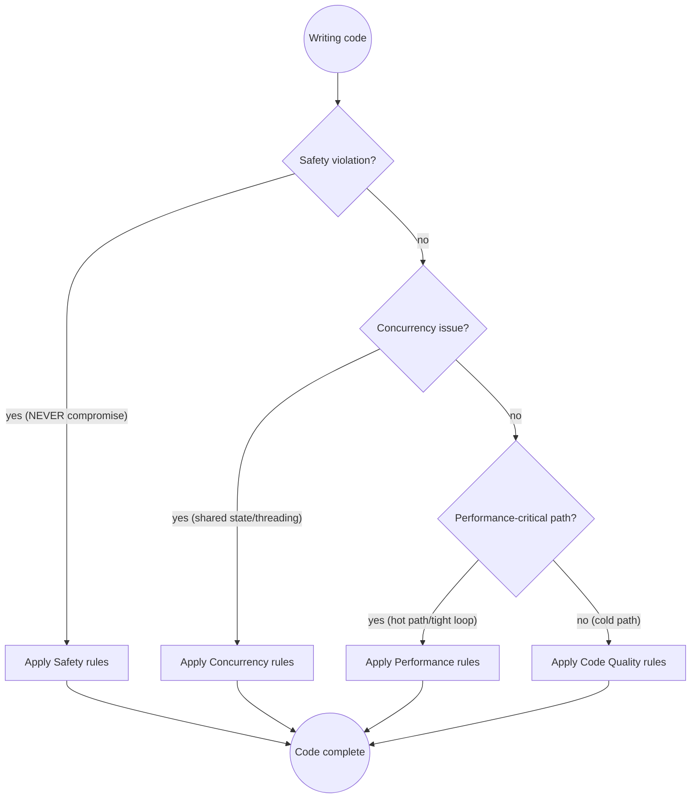

# Java Development

## Quick Reference

| Category | Rule | How to Apply |
|----------|------|--------------|
| **Safety** | Resource leaks | Always use try-with-resources for Closeable |
| | Deadlocks | Document lock ordering; minimize critical sections |
| | Classloader leaks | Remove ThreadLocal values in finally |
| | Silent corruption | Never swallow exceptions; log or rethrow |
| **Concurrency** | Thread model | Prefer thread-local over shared state; document model |
| | Shared state | Use atomic updates or optimistic locking over read-modify-write |
| | Single-threaded code | Add `// NOT thread-safe` comment |
| **Performance** | Hot paths | Avoid streams, boxing, allocations in tight loops |
| | Measuring | Profile before optimizing; don't pre-optimize cold code |
| **Testing** | Framework | JUnit 5 + AssertJ |
| | Mocking | Prefer real wiring/in-memory DB over Mockito |
| | Integration tests | Use real database, not mocks |
| **Code Quality** | Mutability | Mark parameters/variables `final` unless mutated |
| | Imports | Use simple names with imports, not FQNs |
| | Documentation | Javadoc only for non-trivial methods; focus on why |
| | Commits | Keep commits focused; isolate refactors in separate commits |
| | Consolidation | Check class, module, repo levels before duplicating |
| | APIs | Prioritise clean interfaces; fix wrong-shaped ones rather than working around |

### Framework-Specific Quick Picks

| Framework | Testing | DI | Concurrency |
|-----------|---------|----|-------------|
| **Spring Boot** | `@SpringBootTest`, MockMvc, TestRestTemplate | `@RequiredArgsConstructor` + constructor injection | `@Async`, ThreadPoolTaskExecutor |
| **Quarkus** | `@QuarkusTest`, `@QuarkusIntegrationTest`, REST Assured | `@ApplicationScoped` + constructor injection | `@Blocking`, Vert.x event-loop |

## Rule Priority Decision Flow

**Priority order:** Safety > Concurrency > Performance > Code Quality

## Why These Rules Matter

**Resource leaks:** Unclosed HTTP connections exhausted 1024 file descriptors in 20 hours → daily pod restart. Fix: one missing try-with-resources block.

**Deadlocks:** Lock ordering violation between cache update and event publishing → service hung 3 hours at peak. Fix: document lock acquisition order, minimize critical sections.

**Classloader leaks:** ThreadLocal holding request-scoped beans blocked GC after hot redeployments → 200MB growth per deploy, OOM after 10 deploys. Fix: `ThreadLocal.remove()` in finally.

**Silent corruption:** Swallowed exception in payment handler → 1,200 transactions marked "processed" without processing, discovered 3 days later. Fix: log and rethrow.

**Premature optimization:** Primitive arrays "for performance" in a startup-only config parser → off-by-one bug, 4 hours debugging. Cold paths don't need optimizing.

## Reference Files

Detailed guidance on each topic is in the `references/` directory:

| Reference | Covers |
|-----------|--------|
| [`references/safety.md`](references/safety.md) | Resource leaks, classloader leaks, silent corruption, deadlocks |
| [`references/concurrency.md`](references/concurrency.md) | Thread models, read-modify-write, check-then-act, executors, CompletableFuture |
| [`references/naming-and-style.md`](references/naming-and-style.md) | Naming conventions, code clarity, final, imports, text blocks |
| [`references/performance.md`](references/performance.md) | Hot paths, boxing, N+1 prevention, batch queries |
| [`references/testing.md`](references/testing.md) | JUnit 5, AssertJ, framework-specific testing (Spring Boot & Quarkus) |
| [`references/api-and-dtos.md`](references/api-and-dtos.md) | DTO/VO conventions, Lombok, input validation, clean APIs |
| [`references/exceptions-and-logging.md`](references/exceptions-and-logging.md) | Exception handling, null safety, logging |
| [`references/common-pitfalls.md`](references/common-pitfalls.md) | The STOP table — rationalizations that signal danger |
