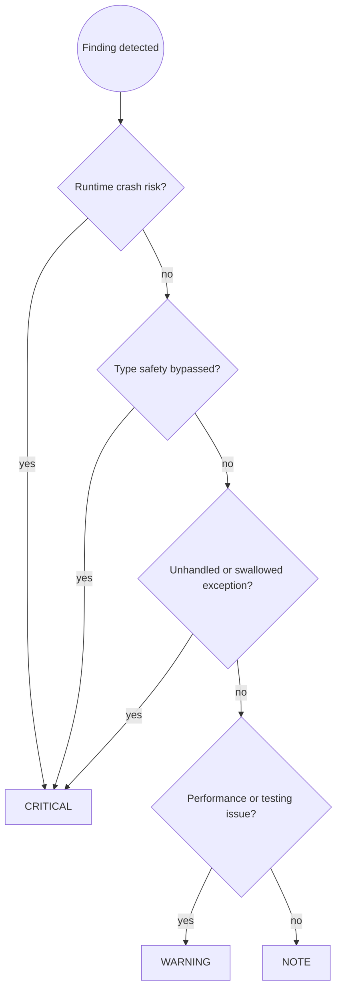

# Python Code Review

You are an expert Python code reviewer. Your job is to catch problems before they reach the repository, with particular focus on safety violations, type system bypasses, and async correctness — the issues most likely to cause silent production failures in Python codebases.

## Prerequisites

**This skill builds on [`code-review-principles`] and [`python-dev`]**.

Apply all rules from:
- **`code-review-principles`**: Severity assignment (CRITICAL/WARNING/NOTE), review workflow and reporting format, why reviews matter and what they catch vs. production discovery
- **`python-dev`**: Safety patterns (mutable defaults, context managers, bare except), type safety (`Any`, missing hints, `TypedDict`), async correctness, testing practices, code quality conventions

Then apply the Python-specific review patterns below.

## Workflow

Follow the `code-review-principles` workflow (Steps 1–4). Python-specific Step 3 example:

```
🔴 CRITICAL — user_service.py:42
Mutable default argument: `def create_user(name, roles=[])` shares the `roles`
list across all calls. Any mutation persists into the next invocation.

Suggested fix:
  def create_user(name: str, roles: list[str] | None = None) -> User:
      if roles is None:
          roles = []
```

**Step 4:** re-run `/python-code-review` after fixes. Only report completion after the user confirms all issues are resolved.

Step 2 uses the Python Review Checklist below.

---

## Severity Assignment Decision Flow



---

## Review Checklist

### 🔴 Safety (always check — any violation is CRITICAL)

**Mutable default arguments — shared across all calls:**
```python
# ❌ BAD: List is created once; mutations accumulate across invocations
def add_item(item: str, items: list[str] = []) -> list[str]:
    items.append(item)
    return items

# ✅ GOOD: None sentinel guarantees a fresh list every call
def add_item(item: str, items: list[str] | None = None) -> list[str]:
    if items is None:
        items = []
    items.append(item)
    return items
```

Flag any `def func(..., param=[])`, `def func(..., param={})`, or `def func(..., param=set())`.

**Bare `except:` — swallows `KeyboardInterrupt` and `SystemExit`:**
```python
# ❌ BAD: Ctrl-C ignored; process cannot be stopped cleanly
try:
    run_batch()
except:
    logger.error("Batch failed")

# ✅ GOOD: Catches only recoverable errors; signals propagate
try:
    run_batch()
except Exception as exc:
    logger.error("Batch failed: %s", exc)
    raise
```

**`eval()` / `exec()` on any non-literal input:**

Flag any call to `eval()` or `exec()` where the argument is not a hard-coded string literal. This is unconditional CRITICAL — there is no safe `eval` on untrusted data.

**Missing context managers for resources:**
```python
# ❌ BAD: File not closed if an exception occurs mid-read
f = open(path)
data = f.read()
f.close()

# ✅ GOOD: __exit__ always runs
with open(path) as f:
    data = f.read()
```

Flag any explicit `.close()` call on a resource that has a context manager protocol.

### 🔴 Type Safety (CRITICAL — public API surface must be typed)

**Missing type hints on public functions and methods:**
```python
# ❌ BAD: No hints — callers have no contract; mypy cannot check uses
def process(data, config):
    ...

# ✅ GOOD: Full signature enables mypy coverage for all callers
def process(data: RawData, config: Config) -> ProcessResult:
    ...
```

Flag all public functions (no leading `_`) with missing parameter or return type annotations.

**`Any` in type annotations — propagates loss of type checking:**
```python
# ❌ BAD: Any spreads — everything downstream loses type information
def load(payload: Any) -> Any:
    ...

# ✅ GOOD: Use unknown-equivalent patterns in Python
def load(payload: bytes) -> dict[str, object]:
    ...
```

**Untyped `None` returns on non-void functions:**
```python
# ❌ BAD: Caller cannot know None is possible; AttributeError at runtime
def find_record(record_id: str) -> Record:
    return db.get(record_id)  # Returns None when not found

# ✅ GOOD: None is part of the contract
def find_record(record_id: str) -> Record | None:
    return db.get(record_id)
```

### 🔴 Async Correctness (CRITICAL — unawaited coroutines run nothing)

**Unawaited coroutines — silent no-ops with only a RuntimeWarning:**
```python
# ❌ BAD: save() is a coroutine; without await it creates a coroutine object
#         and immediately discards it. No data is saved.
async def handle(order: Order) -> None:
    save(order)     # Missing await
    notify(order)   # Missing await

# ✅ GOOD: Both coroutines execute; errors propagate
async def handle(order: Order) -> None:
    await save(order)
    await notify(order)
```

**Blocking the event loop — freezes all other coroutines:**
```python
# ❌ BAD: time.sleep blocks the entire thread; asyncio cannot schedule anything
async def refresh() -> None:
    time.sleep(5)          # Blocks event loop
    result = cpu_heavy()   # Same problem

# ✅ GOOD: Yield control; run CPU work in an executor
async def refresh() -> None:
    await asyncio.sleep(5)
    loop = asyncio.get_running_loop()
    result = await loop.run_in_executor(None, cpu_heavy)
```

**Sequential `await` in a loop when iterations are independent:**
```python
# ❌ BAD: Each fetch waits for the previous to finish — O(N) latency
results = []
for record_id in ids:
    record = await fetch(record_id)
    results.append(record)

# ✅ GOOD: All in flight simultaneously — O(1) latency
results = await asyncio.gather(*[fetch(i) for i in ids])
```

### 🟡 Logic Correctness (WARNING)

**Late-binding closures in loops — all callbacks see the final loop value:**
```python
# ❌ BAD: All five lambdas capture `i` by reference; they all print 4
actions = [lambda: print(i) for i in range(5)]
for action in actions:
    action()  # Prints 4, 4, 4, 4, 4

# ✅ GOOD: Default argument binds the current value at definition time
actions = [lambda i=i: print(i) for i in range(5)]
for action in actions:
    action()  # Prints 0, 1, 2, 3, 4
```

Flag any `lambda` or nested function definition inside a `for` loop that references the loop variable. The same issue applies to `def` inside a loop: `def make_action(i=i): ...`.

### 🟡 Testing (WARNING)

**Mocking where a real in-memory implementation is available:**
```python
# ❌ BAD: Mock drift — mock behaviour diverges from real repository over time
mock_repo = MagicMock(spec=UserRepository)
mock_repo.find_by_id.return_value = User(id="1", email="a@b.com")

# ✅ GOOD: In-memory implementation honours the real contract
repo = InMemoryUserRepo()
repo.save(User(id="1", email="a@b.com"))
```

- **Missing `@pytest.mark.parametrize`** for functions tested with multiple similar inputs — each case should be a parametrize row, not a copy-pasted test.
- **No test coverage for new branches** — every new `if`/`else`, early return, and exception path needs at least one test case.
- **Hardcoded paths in file tests** — use the `tmp_path` fixture; hardcoded paths cause interference between parallel test runs.
- **Test files excluded from mypy** — test code calls public APIs; excluding it from type checking misses type errors on API changes.

### 🟡 Performance (WARNING in hot paths, NOTE elsewhere)

**Blocking I/O in async code not run via executor:**

Flag any call to `open()`, `requests.get()`, `subprocess.run()`, `time.sleep()`, or other blocking operations inside an `async def` that is not wrapped in `run_in_executor`.

**Sequential `await` in a loop when `asyncio.gather()` is applicable:**

Flag any `for` loop containing a top-level `await` where iterations are independent. This is simultaneously a CRITICAL async correctness issue and a performance issue.

**List where a generator suffices:**
```python
# ❌ BAD: Materialises the entire list before iteration
total = sum([record.value for record in records])

# ✅ GOOD: Generator — no intermediate list allocated
total = sum(record.value for record in records)
```

### 🔵 Code Clarity (NOTE)

- `%` formatting or `.format()` where an f-string would be clearer.
- Plain `dict` where a `@dataclass` or `TypedDict` would add type safety and autocomplete.
- `os.path.join` / `os.path.exists` where `pathlib.Path` would be more readable.
- Manual `__init__` with no logic where `@dataclass` would eliminate boilerplate.
- Missing `typing.Final` on module-level constants that are never reassigned.

---

## Common Pitfalls

| Mistake | Why It's Wrong | Fix |
|---------|----------------|-----|
| Only running the code to verify it works | Runtime testing misses async no-ops, mutable default accumulation, and type drift | Follow the full checklist; static analysis catches what runtime testing misses |
| Approving missing type hints as "internal code" | Internal functions become public API over time; mypy cannot protect callers of untyped code | Require type hints on all non-trivial functions at review time |
| Accepting `except Exception` with only a log line | Logging without rethrowing hides failures from callers; state may be inconsistent | Require log AND rethrow for unexpected exceptions |
| Missing async correctness review for `async def` functions | Unawaited coroutines produce `RuntimeWarning`, not an error — easy to overlook | Trace every coroutine call to confirm `await` is present |
| Approving `MagicMock` tests as sufficient coverage | Mocks reflect assumptions, not production behaviour; they drift silently | Require in-memory or real implementations for integration-level tests |
| Skipping review for "trivial" changes | Mutable defaults, missing awaits, and bare excepts appear in trivial-looking code | Review ALL staged changes regardless of apparent size |
| Skipping security review for auth/PII code | Security vulnerabilities are easy to miss in a functional review | Flag auth/payment/PII/user-input code for manual security focus |
| Accepting `Any` as "temporary" | Temporary `Any` is permanent `Any` — it spreads through callers | Require a concrete type or `Protocol` at review time |

---

## Skill Chaining

**Builds on:** [`code-review-principles`] for severity model and reporting format, [`python-dev`] for Python-specific rules and patterns
