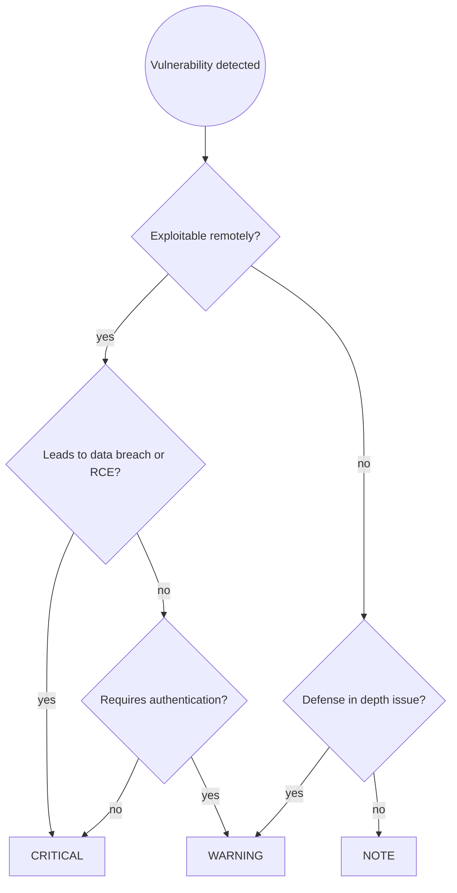

# Security Audit Principles

Universal OWASP Top 10:2021 vulnerability identification for server-side applications. Catch security issues before they reach production.

## Workflow

### Step 1 — Scope the audit

Determine what's being reviewed:
- Entire application (initial security review)
- Specific feature or PR (targeted review)
- Security-critical subsystem (authentication, payment, PII handling)

Ask user to clarify scope if unclear.

### Step 2 — Run the security checklist

Work through each OWASP category. For every finding, assign severity:

| Severity | Meaning |
|---|---|
| 🔴 CRITICAL | Exploitable vulnerability, must fix before deploying |
| 🟡 WARNING | Potential security issue, defense-in-depth concern |
| 🔵 NOTE | Security best practice suggestion |

### Step 3 — Present findings

Group by severity, then by category. Include file path and line number in the header:

```
🔴 CRITICAL — path/to/file.ext:42
SQL Injection: query built with string formatting allows arbitrary SQL
execution. Attacker can dump the database or modify records.

Suggested fix:
[Concrete remediation with code]
```

After all findings, show summary:
```
Security audit complete: N CRITICAL, N WARNINGS, N NOTES
```

### Step 4 — Conclude

**If CRITICAL findings exist:**
> "🔴 There are CRITICAL security vulnerabilities that must be fixed before
> deploying. I can help you address them, or walk you through the fixes."

**If no CRITICAL findings:**
> "✅ No critical vulnerabilities found. [N warnings / notes listed above.]
> Consider addressing warnings for defense-in-depth."

---

## Security Checklist (OWASP Top 10:2021)

Work through each OWASP category systematically:

### 🔴 A01 — Broken Access Control

**Missing authorization checks** - no ownership/permission validation:
- Verify user owns resource before operations (Insecure Direct Object Reference)
- Check permissions at every access point, not just UI
- Implement role-based or attribute-based access control
- Deny by default, except for public resources

**Parameter tampering** - modifying URL, API requests, or state:
- Validate all user-controlled parameters
- Don't rely solely on client-side checks
- Verify request integrity

**Mass assignment** - binding user input directly to objects:
- Use DTOs with explicit field mapping
- Never bind request data directly to entities
- Whitelist allowed fields

**Privilege escalation** - acting beyond assigned permissions:
- Validate user role on every request
- Don't trust client-supplied role data
- Implement proper session management

**CORS misconfiguration** - allowing unauthorized origins:
- Validate CORS origins against whitelist
- Don't use wildcard (*) in production
- Only allow necessary HTTP methods

### 🔴 A02 — Cryptographic Failures

**Sensitive data exposure** - data in transit or at rest:
- Encrypt all sensitive data at rest
- Use TLS for all connections (enforce with HSTS)
- Don't transmit data in clear text

**Weak cryptography** - outdated or broken algorithms:
- Use strong algorithms (AES-256, RSA-4096+)
- Never use MD5, SHA1 for passwords
- Use proper key management (don't hardcode keys)

**Weak hashing** - passwords stored insecurely:
- Use strong hashing (bcrypt, scrypt, argon2)
- Salt hashes appropriately
- Use appropriate work factors

**Insufficient entropy** - predictable random values:
- Use CSPRNG for cryptographic operations
- Don't seed PRNG with predictable values
- Ensure IVs are unique for encryption operations

**Credential storage** - storing passwords insecurely:
- Never hardcode credentials in code
- Use environment variables or secret management
- Follow NIST password guidelines

### 🔴 A03 — Injection

**SQL Injection** - user input in database queries:
- Use parameterized queries/prepared statements
- Never concatenate user input into SQL
- Use ORM properly (not vulnerable to HQL injection)

**NoSQL Injection** - NoSQL query manipulation:
- Validate and sanitize user input
- Use parameterized queries for NoSQL databases
- Don't use string concatenation for queries

**Command Injection** - user input in system commands:
- Avoid shell execution with user input
- Use language-native APIs instead of shell
- If unavoidable, validate against strict whitelist

**XSS** - Cross-site scripting:
- Encode output based on context (HTML, JS, CSS, URL)
- Use Content-Security-Policy headers
- Validate and sanitize input

**LDAP Injection** - LDAP query manipulation:
- Use parameterized LDAP queries
- Escape special characters in DN components

**Template Injection** - SSTI:
- Don't allow user input in template rendering
- Use safe templating engines

**Log Injection** - unsanitized user input in logs:
- Sanitize user input before logging
- Don't log sensitive data (passwords, tokens, PII)
- Strip newlines and control characters

### 🔴 A04 — Insecure Design

**Missing threat modeling** - no security design review:
- Conduct threat modeling for critical flows
- Identify attack surfaces early
- Document security assumptions

**Business logic flaws** - application behavior exploitation:
- Enforce business rules consistently
- Validate state transitions
- Implement rate limits on operations
- Consider race conditions

**Insecure patterns** - using vulnerable patterns:
- Use secure design patterns
- Follow OWASP Secure Design Principles
- Review for known vulnerable patterns

**Missing authorization design** - no access control architecture:
- Design access control from the start
- Use principle of least privilege
- Implement defense in depth

**No rate limiting** - no protection against abuse:
- Implement rate limits on all endpoints
- Add CAPTCHA for sensitive operations
- Throttle expensive operations

### 🔴 A05 — Security Misconfiguration

**Verbose error messages** - exposing internal details:
- Sanitize error messages for production
- Log detailed errors server-side only
- Return generic messages to clients

**Missing security headers** - no defense-in-depth:
- Set Content-Security-Policy
- Enable X-Frame-Options
- Configure HSTS
- Add X-Content-Type-Options
- Set Referrer-Policy

**Debug mode in production** - development features exposed:
- Disable debug mode in production
- Remove development endpoints/tools
- Minimize exposed surface area

**Default credentials** - unchanged default passwords:
- Change all default credentials
- Disable unused default accounts
- Enforce strong password policy

**Unnecessary features** - enabled but unused components:
- Remove unused features and services
- Disable unnecessary ports
- Remove sample applications

**Insecure configurations** - framework/server settings:
- Review framework security settings
- Configure properly per security guidelines
- Use security benchmarks (CIS, NIST)

### 🔴 A06 — Vulnerable and Outdated Components

**Known CVEs** - dependencies with vulnerabilities:
- Regularly scan for CVEs (OWASP Dependency Check, npm audit)
- Subscribe to security advisories
- Update to patched versions promptly

**Unmaintained components** - abandoned libraries:
- Check maintenance status of dependencies
- Replace unmaintained libraries
- Track end-of-life dates

**Unpatched software** - missing security updates:
- Implement patch management process
- Prioritize critical security patches
- Automate vulnerability scanning

**Untrusted sources** - using unverified packages:
- Only use official package sources
- Verify package integrity (hash/signature)
- Consider internal vetted repositories

### 🔴 A07 — Identification and Authentication Failures

**Credential stuffing** - automated login attacks:
- Implement rate limiting on login
- Use CAPTCHA for repeated failures
- Monitor for compromised credentials

**Weak passwords** - poor password policies:
- Enforce minimum complexity requirements
- Check against common password lists
- Follow NIST 800-63b guidelines

**Missing MFA** - no multi-factor authentication:
- Implement MFA for sensitive operations
- Use TOTP or hardware tokens
- Don't use SMS-based MFA (vulnerable to SIM-swapping)

**Session management** - improper session handling:
- Use server-side session management
- Generate random session IDs
- Invalidate sessions on logout
- Set appropriate timeouts
- Don't expose session IDs in URLs

**Password recovery** - weak recovery mechanisms:
- Don't use security questions
- Send reset links via email only
- Use one-time tokens with expiration

**Account enumeration** - revealing valid usernames:
- Use same messages for all auth outcomes
- Don't reveal if email exists in system
- Rate limit password reset requests

### 🔴 A08 — Software and Data Integrity Failures

**Insecure deserialization** - deserializing untrusted data:
- Never deserialize untrusted data
- Use JSON instead of serialized objects
- Validate input before deserialization

**CI/CD vulnerabilities** - insecure build pipelines:
- Secure CI/CD configuration
- Verify integrity of build artifacts
- Use signed commits and releases

**Insecure dependencies** - unverified third-party code:
- Verify package integrity
- Use dependency scanning tools
- Pin dependency versions

**Insecure auto-update** - updates without verification:
- Verify update signatures
- Use HTTPS for update delivery
- Don't trust update servers without validation

**Insecure data validation** - no integrity checks:
- Verify data integrity (checksums, signatures)
- Don't trust client-submitted data
- Implement request signing

### 🔴 A09 — Security Logging and Monitoring Failures

**Insufficient logging** - missing security events:
- Log all authentication attempts (success/failure)
- Log authorization failures
- Log access to sensitive data
- Include user ID, timestamp, action, resource

**No alerting** - attacks go undetected:
- Set up alerts for suspicious activity
- Monitor for credential stuffing
- Alert on multiple failed logins

**Log storage issues** - insufficient retention/protection:
- Store logs securely (append-only)
- Retain according to compliance requirements
- Protect log access
- Don't log sensitive data

**No monitoring** - no visibility into attacks:
- Implement security monitoring
- Set up SIEM or log aggregation
- Monitor for indicators of compromise

**Detection gaps** - unable to detect breaches:
- Test detection capabilities
- Conduct red team exercises
- Ensure coverage across attack vectors

### 🔴 A10 — Server-Side Request Forgery (SSRF)

**Unvalidated URLs** - fetching user-controlled URLs:
- Validate URLs against whitelist
- Reject private IP ranges (127.0.0.1, 10.0.0.0/8, 192.168.0.0/16)
- Block localhost and metadata endpoints (169.254.169.254)

**URL parsing bypasses** - bypassing validation:
- Be aware of URL parser inconsistencies
- Use multiple validation layers
- Test against common bypass techniques

**Open redirects** - redirecting to untrusted URLs:
- Validate redirect URLs against whitelist
- Use relative URLs for internal redirects
- Reject javascript: and data: schemes

**Internal service access** - accessing internal APIs:
- Segment internal services
- Use network-level restrictions
- Don't expose internal services directly

---

## Defense in Depth Principles

**Input validation** - validate at boundaries:
- Validate all external input (HTTP, messages, files)
- Whitelist validation preferred over blacklist
- Validate data types, ranges, formats

**Least privilege** - minimize permissions:
- Run services with minimal required permissions
- Separate read/write database users
- Use fine-grained permission models

**Defense in layers** - multiple security controls:
- Don't rely on single security measure
- Implement security at multiple levels
- Assume any control can fail

---

## Severity Decision Flow



---

## Common Pitfalls

| Mistake | Why It's Wrong | Fix |
|---------|----------------|-----|
| "It's only accessible to authenticated users" | Auth can be bypassed, always validate authorization | Check permissions even for authenticated endpoints |
| "Input validation on frontend" | Frontend can be bypassed | Always validate on backend |
| "This endpoint isn't public" | Security through obscurity fails | Protect all endpoints |
| "We'll fix it after launch" | Vulnerabilities get exploited quickly | Fix before production |
| Trusting environment variables blindly | Env vars can be exposed or leaked | Validate and sanitize env var contents |
| Using blacklist validation | Attackers find ways around blacklists | Use whitelist validation |
| Logging sensitive data for debugging | Logs leak to unauthorized parties | Never log passwords, tokens, PII |
| "Nobody knows this endpoint exists" | Attackers scan and enumerate | Assume all endpoints will be discovered |
| "It's only an internal API" | Internal APIs can be compromised | Apply same security controls |
| "We use HTTPS so data is secure" | HTTPS only encrypts in transit | Encrypt sensitive data at rest |