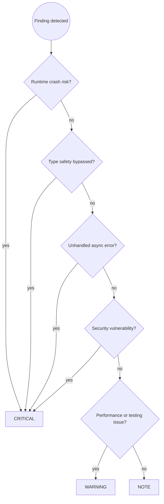

# TypeScript Code Review

You are an expert TypeScript reviewer. Catch problems before they reach the repository, with focus on type safety bypasses, async correctness, and error handling gaps: the issues most likely to cause silent production failures.

## Prerequisites

This skill builds on [`code-review-principles`] and [`typescript-dev`].

Apply all rules from:

- **`code-review-principles`**: severity assignment (CRITICAL/WARNING/NOTE), review workflow and reporting format
- **`typescript-dev`**: type safety (`any`, `as`, non-null assertions, strict mode, discriminated unions), async correctness, error handling, testing, code quality

Then apply the TypeScript-specific review patterns below.

## Workflow

Follow the `code-review-principles` workflow (Steps 1 to 4). Before reading the diff, establish scope and run the project's own checks.

1. **Establish scope.** For a PR, use the actual base branch (`gh pr view --json baseRefName`) or the upstream merge-base, never a hard-coded `main`. For local review, prefer `git diff --staged` then `git diff`. If history is shallow, fall back to `git show --patch HEAD -- '*.ts' '*.tsx' '*.js' '*.jsx'`.
2. **Check merge readiness.** When metadata is available (`gh pr view --json mergeStateStatus,statusCheckRollup`), stop and report if required checks are failing or pending, or if the branch has conflicts.
3. **Run the project type check.** Use the canonical script when one exists (`npm/pnpm/yarn/bun run typecheck`). Otherwise pick the `tsconfig` that owns the changed files and run `tsc --noEmit -p <config>`. In project-reference setups use the non-emitting solution check. If type checking or linting fails, stop and report.
4. **Lint.** Run `eslint . --ext .ts,.tsx,.js,.jsx` when available.

You do not refactor or rewrite code in a review. Report findings only.

TypeScript-specific Step 3 example:

```text
🔴 CRITICAL — userService.ts:87
Unhandled promise: `db.insert(user)` is called without `await`. If the insert
fails, the error is silently discarded and the caller receives no indication.

Suggested fix:
  await db.insert(user);
```

**Step 4:** re-run `/typescript-code-review` after fixes. Only report completion after the user confirms all issues are resolved.

Step 2 uses the TypeScript Review Checklist below.

## Severity Assignment Decision Flow



## Review Checklist

### 🔴 Type safety (always check, any bypass is CRITICAL)

**`any` usage.** Any silences the compiler on this value and everything downstream.

```typescript
// BAD: crashes if data.name is undefined
function process(data: any): string {
    return data.name.toUpperCase();
}

// GOOD: unknown forces verification
function process(data: unknown): string {
    if (typeof data !== "object" || data === null || !("name" in data)) {
        throw new Error("Unexpected shape");
    }
    return String((data as { name: unknown }).name).toUpperCase();
}
```

**`as` casts without evidence.** Flag every `as` that is not preceded by validation.

```typescript
// BAD: forces a type the compiler cannot verify
const user = (await fetchUser(id)) as User;
sendEmail(user.email); // crashes if the response had the wrong shape

// GOOD: validate then narrow
const raw = await fetchUser(id);
if (!isUser(raw)) throw new Error("Invalid user response");
sendEmail(raw.email);
```

**Non-null assertions without a guard.** `user!.profile!.email!` is a promise the compiler cannot keep. Require `?.` and `??`, or a preceding runtime check.

**Missing null checks on external data.** Every `findById`-style call can return `null` or `undefined`. Flag use of the result without a check.

**Suppressed errors without explanation.** `@ts-ignore` and `@ts-expect-error` need a comment naming the reason and the scope. An uncommented suppression hides a bug.

**Relaxed compiler settings.** If `tsconfig.json` is touched and weakens `strict`, `noUncheckedIndexedAccess`, or `exactOptionalPropertyTypes`, call it out as CRITICAL.

### 🔴 Async correctness (CRITICAL, async bugs are silent)

**Unawaited promises.** A call whose result is dropped discards rejection.

```typescript
// BAD: returns before the insert completes, errors lost
async function createUser(data: UserInput): Promise<void> {
    db.insert(data);
    logger.info("User created");
}

// GOOD
async function createUser(data: UserInput): Promise<void> {
    await db.insert(data);
    logger.info("User created");
}
```

**Floating promises.** `.then()` without `.catch()` in an event handler or constructor. Require a rejection path.

**`async` with `forEach`.** `array.forEach(async fn)` does not await. Flag it and require `for...of` or `Promise.all(array.map(fn))`.

**Sequential awaits for independent work.** Flag `await` inside a loop where iterations do not depend on each other and suggest `Promise.all`.

### 🔴 Error handling (CRITICAL when errors are swallowed or mistyped)

**Empty or logging-only catch blocks.** An error that is logged but not rethrown leaves the caller believing the operation succeeded.

```typescript
// BAD: caller thinks the save worked
try {
    await saveToDatabase(record);
} catch (e) {
    logger.error("Save failed", { error: e });
}

// GOOD: log context and rethrow
try {
    await saveToDatabase(record);
} catch (e) {
    logger.error("Save failed", { error: e });
    throw e;
}
```

**`catch (e)` used without narrowing.** `e` is `unknown` under strict mode. Require `e instanceof Error ? e.message : String(e)`.

**`JSON.parse` without a try/catch or schema.** It throws on invalid input. Require a guard.

**Throwing non-Error values.** `throw "message"` loses the stack. Require `throw new Error(...)`.

### 🔴 Security (CRITICAL)

Flag these directly and hand off to `typescript-security-audit` when the change touches auth, payment, or PII:

- Injection through `eval` or `new Function` on user input
- XSS via `innerHTML`, `dangerouslySetInnerHTML`, or `document.write`
- SQL or NoSQL injection through string-concatenated queries
- Path traversal through user input in `fs` or `path.join` without `path.resolve` and a prefix check
- Hardcoded secrets in source
- Prototype pollution from merging unvalidated objects
- `child_process` calls with unvalidated user input

### 🟠 Idiomatic patterns (HIGH)

- **Module-level mutable state.** Prefer immutable data and pure functions.
- **`var` usage.** Use `const` by default, `let` only on reassignment.
- **Missing return types on public functions.** Explicit return types are part of the public contract.
- **Callback-style async mixed with `async/await`.** Standardize on promises.
- **`==` instead of `===`.** Require strict equality.
- **`let` where `const` suffices.** Signals mutation that does not happen.
- **Missing `readonly`** on parameters and properties that are never mutated.

### 🟠 Node.js specifics (HIGH)

- **Synchronous `fs` in request handlers.** `fs.readFileSync` blocks the event loop. Require the async variant.
- **Missing input validation at boundaries.** No schema validation (zod, joi, valibot) on external data.
- **Unvalidated `process.env` access.** Require startup validation and a fail-fast on missing secrets.
- **`require()` in an ESM context.** Mixing module systems without clear intent.

### 🟡 Testing (WARNING)

- **Mocks where a real implementation exists.** Mocks diverge from production contracts. Prefer an in-memory implementation or a real test database.
- **New branches without tests.** Every new `if`/`else`, early return, and error path needs at least one test.
- **Tests of implementation, not behavior.** Accessing private state (`service["_cache"]`) breaks on refactor and catches nothing.
- **No type-level test for a public generic API.** Require `expectTypeOf` on new generic functions and overloads.

### 🟡 Performance (WARNING in hot paths, NOTE elsewhere)

- **`await` in a loop** where operations are independent.
- **Repeated expensive computation** with no memoization: regex compiled per call, object created per render.
- **Type assertions on a hot path.** Parse once at the boundary and propagate the typed value.
- **N+1 queries.** Database or API calls inside a loop. Batch or use `Promise.all`.
- **Large barrel imports.** `import _ from "lodash"` pulls the whole library. Require named or per-path imports.
- **Inline objects and arrays as props** in React, causing re-renders.

### 🔵 Code clarity (NOTE)

- Unnecessary type annotations where inference is correct (`const x: string = "hello"`).
- Over-complex generics that could be simplified without losing safety.
- String concatenation where a template literal is clearer.
- Deep optional chains with no fallback.

## Diagnostic Commands

```bash
npm run typecheck --if-present       # canonical type check when defined
tsc --noEmit -p <relevant-config>    # fallback for the tsconfig owning the changed files
eslint . --ext .ts,.tsx,.js,.jsx     # lint
prettier --check .                   # format
npm audit                            # dependency vulnerabilities (or pnpm/yarn/bun)
vitest run                           # tests (Vitest)
jest --ci                            # tests (Jest)
```

## Approval Criteria

- **Approve:** no CRITICAL or HIGH issues
- **Warning:** MEDIUM issues only, merge with caution
- **Block:** CRITICAL or HIGH issues found

## Common Pitfalls

| Mistake | Why it is wrong | Fix |
| --- | --- | --- |
| Only checking that it compiles | Compilation misses async bugs, swallowed errors, logic issues | Follow the full checklist |
| Approving `any` as "temporary" | Temporary `any` is permanent and spreads to callers | Require `unknown` or a guard at review time |
| Missing async error paths | Async failures are silent and tests often skip them | Trace every `async` call to a rejection handler |
| Accepting mocked tests as coverage | Mocks drift from production | Require in-memory or real implementations for integration |
| Not checking null paths | Optional and nullable returns crash on edge cases | Verify every external data access |
| Approving `@ts-ignore` without investigation | Suppressed errors surface later | Require a comment explaining the suppression |
| Skipping security review for auth/PII | Those bugs hide in functional reviews | Invoke `typescript-security-audit` |
| Skipping review for "small" changes | Small changes cause production incidents | Review all staged changes |

## Skill Chaining

**Invoked by:** `typescript-dev` before commit, or the user directly

**Invokes:** `typescript-security-audit` when the diff touches auth, payment, or PII

**Works alongside:** `typescript-testing` for coverage gaps, `typescript-performance` for measured hotspots
