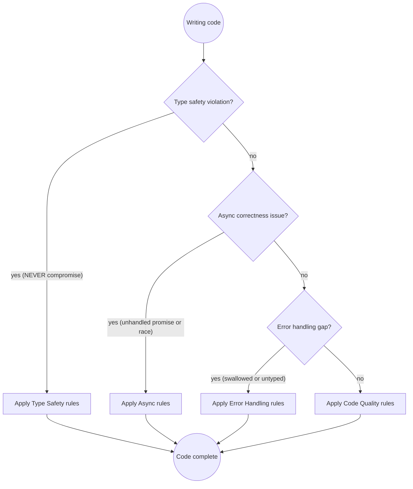

# TypeScript Development

TypeScript's value is catching errors at compile time. Rules that bypass the type system defeat the point of using it. The rules below mark the difference between a codebase the compiler protects and one where `any` and `as` move every failure to runtime.

## Quick Reference

| Category | Rule | How to Apply |
| --- | --- | --- |
| **Type Safety** | Never use `any` | Use `unknown` and narrow; `any` disables checking downstream |
| | No `as` casts | Cast only after validation; an unevidenced `as` is a runtime crash |
| | No non-null assertions | `!` crashes on edge cases; use `?.` and `??` instead |
| | Strict mode is non-negotiable | `strict: true` plus `noUncheckedIndexedAccess` and `exactOptionalPropertyTypes` |
| | Discriminated unions over flags | Model variants with a shared literal `kind`; no impossible states |
| | `interface` for shapes, `type` for unions | Object shapes extend and implement; unions and mapped types use `type` |
| | Explicit types on public APIs | Parameter and return types on exported functions; let locals infer |
| | Brand primitives at the boundary | `string & { readonly __brand: "UserId" }` stops id mix-ups |
| | `satisfies` over `as` | Validates without widening literal types |
| | Exhaustiveness in default arms | `const _exhaustive: never = x;` fails the build on a new variant |
| **Async** | Always `await` promises | A dropped promise discards its error silently |
| | No `await` in loops unless ordered | Use `Promise.all`; sequential awaits multiply latency by N |
| | `Promise.allSettled` for partial failure | One rejection must not drop the other results |
| | `forEach(async ...)` does nothing | Use `for...of` or `Promise.all(array.map(...))` |
| **Error Handling** | Narrow `catch (e)` | `e` is `unknown` in strict mode; check `instanceof Error` first |
| | Never swallow errors | Log XOR rethrow, never both; an empty catch hides the bug |
| | Result types for expected failures | Discriminated union for validation and not-found paths |
| | Throw `Error`, not strings | `throw "msg"` loses the stack and the type |
| **Testing** | Prefer real implementations | Mocks drift; real integrations catch real bugs |
| | Test behavior, not internals | Assert observable outcomes, not private state |
| | Type-level assertions | `expectTypeOf` on public generic APIs |
| **Code Quality** | `const` over `let`, never `var` | Reassignment is a signal, not a default |
| | `readonly` where possible | Parameters and fields that never mutate |
| | Zod at every boundary | Parse external input into a named type once |
| | No `console.log` in production | Use a structured logger with context |
| | Template literals over concatenation | No escaping bugs, clearer interpolation |

## Rule Priority Decision Flow



**Priority order:** Type Safety > Async Correctness > Error Handling > Code Quality

Testing and performance are context-dependent. Apply testing rules when writing tests, and performance rules only after a profiler or type-check trace shows a bottleneck.

## Reference Guide

Load detailed guidance based on context:

| Topic | Reference | Load when |
| --- | --- | --- |
| Advanced types | `references/type-system.md` | Generics, conditional and mapped types, branded types, narrowing, exhaustiveness |
| Configuration | `references/configuration.md` | tsconfig options, strict flags, project references, build performance |

## Type Safety

**Never use `any`. Use `unknown` and narrow.**

```typescript
// BAD: any silences the compiler on this value and everything downstream
function parseResponse(data: any): string {
    return data.user.name.toUpperCase(); // crashes if the shape changes
}

// GOOD: unknown forces verification before use
function parseResponse(data: unknown): string {
    if (
        typeof data === "object" &&
        data !== null &&
        "user" in data &&
        typeof (data as { user: unknown }).user === "object"
    ) {
        const user = (data as { user: { name: string } }).user;
        return user.name.toUpperCase();
    }
    throw new Error("Unexpected response shape");
}
```

External data is always `unknown`: RPC payloads, `JSON.parse` results, `postMessage`, file contents, environment variables, database rows.

**Avoid `as` casts. They suppress the compiler without evidence.**

```typescript
// BAD: forces a type the compiler cannot verify
const user = response.data as User;
console.log(user.email.toLowerCase()); // crashes if email is undefined

// GOOD: parse and validate
function toUser(data: unknown): User {
    if (!isUser(data)) throw new Error("Invalid user shape");
    return data;
}

function isUser(data: unknown): data is User {
    return (
        typeof data === "object" &&
        data !== null &&
        typeof (data as Record<string, unknown>).email === "string"
    );
}
```

When an existing `as` is hard to remove, find out why inference fails. The usual causes are a missing discriminant, an overly wide source type, or an untyped boundary that needs a parse function.

**No non-null assertions. Prefer optional chaining and nullish coalescing.**

```typescript
// BAD: asserts non-null without evidence
const email = user!.profile!.email!.toLowerCase();

// GOOD: safe navigation with a fallback
const email = user?.profile?.email?.toLowerCase() ?? "unknown";
```

**`strict: true` is non-negotiable.** It turns on `strictNullChecks`, `noImplicitAny`, `strictFunctionTypes`, and related checks. A codebase without it is TypeScript in name only. Two further flags catch real bugs:

```json
{
  "compilerOptions": {
    "strict": true,
    "noUncheckedIndexedAccess": true,
    "exactOptionalPropertyTypes": true
  }
}
```

**Model state with discriminated unions, not boolean flags.**

```typescript
// BAD: boolean flags allow impossible states
interface FetchState {
    loading: boolean;
    error: boolean;
    data?: User;
}

// GOOD: every state is explicit and valid
type FetchState =
    | { status: "idle" }
    | { status: "loading" }
    | { status: "error"; error: Error }
    | { status: "success"; data: User };
```

Pick one discriminant name (`kind`, `status`, or `type`) and keep it consistent. Add an exhaustiveness check in the default arm so a new variant fails the build:

```typescript
function render(state: FetchState): string {
    switch (state.status) {
        case "idle": return "Ready";
        case "loading": return "Loading";
        case "error": return state.error.message;
        case "success": return state.data.email;
        default: {
            const _exhaustive: never = state;
            return _exhaustive;
        }
    }
}
```

**Use `interface` for object shapes and `type` for unions, intersections, and mapped types.** Prefer string literal unions over `enum` unless the `enum` is needed for interoperability.

```typescript
interface User {
    id: string;
    email: string;
}

type UserRole = "admin" | "member";
type AdminUser = User & { role: "admin" };
```

**Type public APIs explicitly.** Add parameter and return types to exported functions, shared utilities, and public class methods. Let TypeScript infer obvious local variables.

```typescript
// WRONG: exported function without explicit types
export function formatUser(user) {
    return `${user.firstName} ${user.lastName}`;
}

// CORRECT: explicit types on the public API
interface User {
    firstName: string;
    lastName: string;
}

export function formatUser(user: User): string {
    return `${user.firstName} ${user.lastName}`;
}
```

**Brand primitives so they cannot be mixed up.** Validate once at the boundary, then trust the type inside.

```typescript
type Brand<T, B extends string> = T & { readonly __brand: B };
type UserId = Brand<string, "UserId">;
type OrderId = Brand<number, "OrderId">;

const toUserId = (id: string): UserId => id as UserId; // earned cast after validation

function getOrder(userId: UserId, orderId: OrderId) { /* ... */ }
```

**Reach for `satisfies` before `as`.** It validates the value without widening literal types.

```typescript
// BAD: widens, loses the literal type
const config = { theme: "dark", cols: 3 } as Config;

// GOOD: validates and preserves the literal type
const config = { theme: "dark", cols: 3 } satisfies Config;
// config.theme is "dark", not string
```

**Narrowing hierarchy, best first:** discriminated union switch, `in` operator, `typeof`/`instanceof`, user-defined type guard, then `as` as a last resort. A guard that lies is worse than `as` because the bug hides behind a name that promises safety.

## Async Patterns

Async bugs are hard to reproduce. They surface under load, on slow networks, and in narrow timing windows.

**Always `await` promises. Unhandled rejections crash Node.js.**

```typescript
// BAD: promise returned but not awaited, error silently discarded
async function saveOrder(order: Order): Promise<void> {
    db.insert(order);              // missing await
    sendConfirmationEmail(order.email);
}

// GOOD: explicit await, errors propagate
async function saveOrder(order: Order): Promise<void> {
    await db.insert(order);
    await sendConfirmationEmail(order.email);
}
```

**Never `await` inside a loop unless sequential order is required.**

```typescript
// BAD: sequential when parallel is possible, N times the latency
for (const id of userIds) {
    results.push(await fetchUser(id));
}

// GOOD: all requests in flight together
const results = await Promise.all(userIds.map(fetchUser));
```

**Use `Promise.allSettled` when one failure must not abort the rest.**

```typescript
const results = await Promise.allSettled(userIds.map(fetchUser));
const users = results
    .filter((r): r is PromiseFulfilledResult<User> => r.status === "fulfilled")
    .map((r) => r.value);
```

**`array.forEach(async fn)` does not await.** The loop returns before the callbacks settle and rejections are lost. Use `for...of` with `await`, or `Promise.all(array.map(fn))`.

**Promisify callbacks before mixing them with `async`.** A `throw` inside a callback is not caught by the surrounding `try`.

```typescript
// BAD: throwing inside the callback is unhandled
async function readFile(path: string): Promise<string> {
    return new Promise((resolve) => {
        fs.readFile(path, "utf-8", (err, data) => {
            if (err) throw err;
            resolve(data);
        });
    });
}

// GOOD: reject the promise
async function readFile(path: string): Promise<string> {
    return new Promise((resolve, reject) => {
        fs.readFile(path, "utf-8", (err, data) => {
            if (err) reject(err);
            else resolve(data);
        });
    });
}
```

## Error Handling

**`catch (e)` gives `unknown` in strict mode. Narrow before touching it.**

```typescript
try {
    await processPayment(order);
} catch (e) {
    const message = e instanceof Error ? e.message : String(e);
    logger.error("Payment failed", { orderId: order.id, error: message });
    throw e;
}
```

**Never swallow errors.** An empty catch block hides the failure from the caller and leaves state inconsistent. Log and propagate.

```typescript
// BAD: error disappears
try {
    await syncInventory();
} catch (_e) {}

// GOOD: log context and rethrow
try {
    await syncInventory();
} catch (e) {
    logger.error("Inventory sync failed", { error: e });
    throw e;
}
```

**Use discriminated union results for expected failures.** Validation errors and not-found are control flow, not exceptions.

```typescript
type Result<T, E = Error> =
    | { ok: true; value: T }
    | { ok: false; error: E };

async function findUser(id: string): Promise<Result<User, "not-found" | "db-error">> {
    try {
        const user = await db.users.findById(id);
        if (!user) return { ok: false, error: "not-found" };
        return { ok: true, value: user };
    } catch {
        return { ok: false, error: "db-error" };
    }
}
```

Separate expected errors from unexpected ones. Network timeouts and validation failures get `Result`. Programmer errors and broken invariants throw and crash loudly.

**Throw `Error` instances, never strings.** `throw "bad input"` loses the stack and forces string matching at the catch site.

## Testing

Use Jest or Vitest, `@testing-library/*` for UI, `msw` for HTTP at the network layer, and an in-memory implementation over a mock. Full patterns live in [`typescript-testing`].

```typescript
// GOOD: in-memory implementation honors the real contract
class InMemoryUserRepository implements UserRepository {
    private users = new Map<string, User>();
    async findById(id: string): Promise<User | null> {
        return this.users.get(id) ?? null;
    }
    async save(user: User): Promise<void> {
        this.users.set(user.id, user);
    }
}

// GOOD: assert the type of a public generic API
import { expectTypeOf } from "vitest";
test("parseUser returns User", () => {
    expectTypeOf(parseUser({ id: "1", email: "a@b.com" })).toEqualTypeOf<User>();
});
```

## Code Quality and Patterns

**`readonly` on parameters and fields that never mutate.**

```typescript
// BAD: mutates the caller's array
function processUsers(users: User[]): void {
    users.sort((a, b) => a.name.localeCompare(b.name));
}

// GOOD: copy before sorting
function processUsers(users: readonly User[]): void {
    const sorted = [...users].sort((a, b) => a.name.localeCompare(b.name));
}
```

**`const` over `let`, never `var`.** `let` signals reassignment; use it only when reassignment happens.

**Immutable updates with spread.**

```typescript
function updateUser(user: Readonly<User>, name: string): User {
    return { ...user, name }; // no mutation
}
```

**Validate external input with a schema, and infer the type from it.** One schema owns the shape. Do not maintain a schema, a duplicate interface, and a hand-written guard that drift apart.

```typescript
import { z } from "zod";

const UserSchema = z.object({
    email: z.string().email(),
    age: z.number().int().min(0).max(150),
});

type UserInput = z.infer<typeof UserSchema>;
const input = UserSchema.parse(req.body); // throws ZodError on invalid
```

Use `safeParse` when failure is an expected branch. If the codebase already uses another schema library, use that one; do not add a dependency for a single guard.

**Pass objects, not long positional argument lists.** Object args make order self-documenting and order-independent. Skip this on hot paths where the allocation matters.

```typescript
// BAD: swapping two args still compiles
openFile(uri, { startLineNumber: 10, startColumn: 1, endLineNumber: 10, endColumn: 1 });

// GOOD: order-independent, named
openFile({ uri, selection: { startLineNumber: 10, startColumn: 1, endLineNumber: 10, endColumn: 1 } });
```

**Extract repeated inline object shapes into named types.** A named type is reusable and produces readable errors.

**No `console.log` in production.** Use a structured logger with enough context to debug from an id.

**React props:** define them with a named `interface` or `type`, type callbacks explicitly, and avoid `React.FC` unless there is a specific reason.

```typescript
interface UserCardProps {
    user: User;
    onSelect: (id: string) => void;
}

function UserCard({ user, onSelect }: UserCardProps) {
    return <button onClick={() => onSelect(user.id)}>{user.email}</button>;
}
```

**JavaScript files:** in `.js` and `.jsx`, use JSDoc when types improve clarity and a migration is not practical. Keep it aligned with runtime behavior.

## Common Pitfalls

If you catch yourself thinking any of these, stop and apply the correct approach:

| Rationalization | Problem | Fix |
| --- | --- | --- |
| "TypeScript is just JavaScript, type errors are fine" | Type errors signal real bugs | Fix the type error, do not suppress it |
| "I'll add proper types later" | Technical debt never gets paid, `any` spreads | Type it now while context is fresh |
| "`as any` fixes it quickly" | Defeats the type system for every caller | Use `unknown` and a type guard |
| "Promise errors are handled somewhere up the chain" | They are not unless explicitly propagated | `await` and `catch` explicitly |
| "`await` in a loop is fine for now" | Sequential where parallel is correct | Use `Promise.all` |
| "I'll mock the database in tests" | Mocks diverge from real behavior | Use an in-memory implementation or a real DB |
| "`catch (e) { console.log(e) }`" | Error swallowed after logging | Log and rethrow |
| "The non-null assertion is safe here" | Crashes on the one edge case | Use optional chaining and a null check |
| "I know this is a string" (`as string`) | The runtime value may not be | Verify with a type guard |
| "The types are too complex, I'll use `any`" | Complexity is a design smell | Simplify the design or use `unknown` |
| "`@ts-ignore` just for now" | Suppresses the error, hides the bug | Fix the root cause |

## Prerequisites and Chaining

- **`code-review-principles`** for the review workflow once code is written
- **`typescript-code-review`** before committing to catch type safety, async, and error handling issues
- **`typescript-testing`** when adding or restructuring tests
- **`typescript-security-audit`** for authentication, authorization, payment, or PII code
- **`typescript-performance`** when a profiler or type-check trace shows a hotspot
