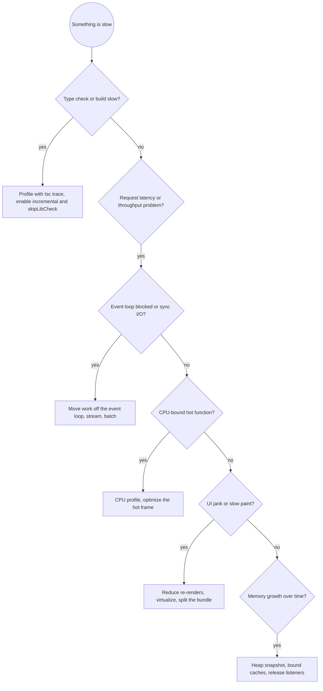

# TypeScript Performance

Measure before changing anything. Intuition about performance is wrong often enough that an unmeasured change is as likely to make things worse as better. The workflow below is: profile, find the dominant cost, fix that one thing, re-measure.

## Quick Reference

| Category | Rule | How to Apply |
| --- | --- | --- |
| **Method** | Profile before optimizing | Use a profiler or trace, not intuition |
| | Find the dominant cost | Optimize the top item, not the easy one |
| | Change one thing and re-measure | A bundle of changes cannot be attributed |
| | Optimize the p95, not the average | Tail latency is what users feel |
| **Type check** | `skipLibCheck` | The single biggest type-check speedup |
| | `incremental` plus project references | Recheck only what changed |
| | Trace before guessing | `tsc --generateTrace` plus `@typescript/analyze-trace` |
| **Node runtime** | Never block the event loop | No sync `fs`, no heavy CPU in a request handler |
| | Stream large payloads | Avoid buffering whole files or responses in memory |
| | Batch and pool | One query with an `IN` list, not N queries; reuse connections |
| | Cache with a bound | Memoize expensive pure work, but bound the cache size and TTL |
| | Offload CPU to workers | `worker_threads` for hashing, parsing, image work |
| **Frontend** | Avoid re-render work | Hoist inline objects, memoize expensive children |
| | Virtualize long lists | Render the visible window |
| | Split the bundle | Route-level dynamic imports, named imports over barrels |
| | Analyze the bundle | `rollup-plugin-visualizer` or `webpack-bundle-analyzer` |
| **Memory** | Bound every cache | An unbounded `Map` is a leak |
| | Release listeners and timers | Remove on unmount, clear intervals |
| | Take a heap snapshot | Compare before and after to find retained objects |

## Bottleneck Decision Flow



## Measure first

| Target | Tool |
| --- | --- |
| Type-check time | `tsc --extendedDiagnostics`, `tsc --generateTrace trace`, `npx @typescript/analyze-trace trace` |
| Node CPU | `node --cpu-prof`, `node --prof` plus `--prof-process`, `0x`, `clinic flame` |
| Node event loop | `clinic doctor`, `perf_hooks.monitorEventLoopDelay()` |
| Node memory | `node --heap-prof`, `--inspect` plus Chrome DevTools heap snapshots |
| HTTP latency | `autocannon`, `k6`, `wrk`; report p50, p95, p99 |
| Bundle size | `rollup-plugin-visualizer`, `webpack-bundle-analyzer`, `source-map-explorer` |
| Browser render | Chrome DevTools Performance panel, Lighthouse, `performance.mark`/`measure` |

Instrument the real path. A microbenchmark of an isolated function can rank candidates, but it does not tell you which function the request spends its time in.

```typescript
import { monitorEventLoopDelay } from "perf_hooks";

const histogram = monitorEventLoopDelay({ resolution: 20 });
histogram.enable();

setInterval(() => {
    logger.info("event loop", {
        p99Ms: histogram.percentile(99) / 1e6,
    });
}, 10_000);
```

A p99 event-loop delay above a few milliseconds means something is blocking the loop.

## Type-check and build performance

Type-check slowness is almost always dependency declarations or repeated work on unchanged files.

```json
{
  "compilerOptions": {
    "skipLibCheck": true,
    "incremental": true,
    "composite": true,
    "isolatedModules": true,
    "noEmit": true
  }
}
```

- `skipLibCheck` skips checking `.d.ts` files in dependencies. Keep it on unless you are auditing a specific dependency's types.
- `incremental` writes `.tsbuildinfo` and rechecks only changed files. Cache it in CI between runs.
- Project references split a monorepo into composite projects so an unchanged package is not rechecked.
- `types` in the config pulls every listed `@types` package into every file's scope. List only what the project needs.

Diagnose the offenders with a trace:

```bash
tsc --generateTrace trace
npx @typescript/analyze-trace trace
```

The trace ranks files and types by check time. A recursive type that expands a few levels too deep and a large union that forces repeated comparison are the usual causes.

Keep the bundler separate from the type checker. Run `tsc --noEmit` for checking and let esbuild or SWC do the transpile; a single tool doing both is slower than either alone.

## Node.js runtime performance

The event loop is single-threaded. Any synchronous work longer than a few milliseconds delays every other request.

**Never use synchronous `fs` in a request path.**

```typescript
// BAD: blocks the event loop for the whole file read
app.get("/config", (_req, res) => {
    res.send(fs.readFileSync("./config.json", "utf-8"));
});

// GOOD: async, and cache what is stable
app.get("/config", async (_req, res) => {
    res.send(await fs.readFile("./config.json", "utf-8"));
});
```

**Stream large payloads instead of buffering them.**

```typescript
// BAD: the whole file sits in memory
app.get("/video/:id", async (req, res) => {
    res.send(await fs.readFile(`./media/${req.params.id}`));
});

// GOOD: stream it
app.get("/video/:id", (req, res) => {
    fs.createReadStream(`./media/${req.params.id}`).pipe(res);
});
```

**Batch and pool database work.** N+1 is the most common backend performance bug: one query per item in a loop.

```typescript
// BAD: N queries
for (const id of ids) {
    const user = await db.query("SELECT * FROM users WHERE id = $1", [id]);
    users.push(user);
}

// GOOD: one query, or Promise.all when the driver pools connections
const users = await db.query("SELECT * FROM users WHERE id = ANY($1)", [ids]);
```

**Offload CPU-bound work to `worker_threads`.** Hashing, large JSON parsing, image and PDF processing, and compression all belong off the main thread.

```typescript
import { Worker } from "node:worker_threads";

function hashInWorker(file: string): Promise<string> {
    return new Promise((resolve, reject) => {
        const worker = new Worker(new URL("./hash-worker.js", import.meta.url), {
            workerData: { file },
        });
        worker.once("message", resolve);
        worker.once("error", reject);
    });
}
```

**Cache expensive pure work, with a bound.** Memoize a compiled regex or a parsed config. Never let a cache grow without a size or TTL limit; an unbounded `Map` keyed by user input is a memory leak.

```typescript
// BAD: the regex is compiled on every call
function isValidEmail(email: string): boolean {
    return /^[^\s@]+@[^\s@]+\.[^\s@]+$/.test(email);
}

// GOOD: compiled once
const EMAIL_RE = /^[^\s@]+@[^\s@]+\.[^\s@]+$/;
function isValidEmail(email: string): boolean {
    return EMAIL_RE.test(email);
}
```

**Prefer objects over arrays for repeated lookup.** `Map` and `Set` give O(1) lookup where `Array.includes` and `Array.find` are O(n) inside a loop.

## Frontend performance

Unnecessary re-renders are the first thing to check, then the bundle.

```tsx
// BAD: a new object every render makes the child re-render every time
<Child config={{ theme, size }} />

// GOOD: hoist stable values, or wrap the child
const config = useMemo(() => ({ theme, size }), [theme, size]);
<Child config={config} />
```

- Memoize expensive computations with `useMemo` and expensive components with `React.memo`, but only when a profile shows the cost. Everything memoized is itself a cost.
- Virtualize long lists (for example `@tanstack/react-virtual`) so only the visible window renders.
- Split the bundle at route boundaries with dynamic `import()`. Ship the initial route, not the whole app.
- Replace barrel imports. `import { debounce } from "lodash"` pulls the library; `import debounce from "lodash/debounce"` pulls one module. Prefer tree-shakeable libraries.
- Analyze the bundle after any dependency change. A single large import can add hundreds of kilobytes.

## Memory

- Bound every cache with a maximum size and a TTL. Use an LRU structure when the key space is unbounded.
- Release resources on unmount: remove event listeners, clear `setInterval`, abort in-flight `fetch` with `AbortController`.
- Take a heap snapshot, exercise the suspected path, take a second snapshot, and compare retained objects. The objects that grow are the leak.
- Watch for closures that retain large objects, module-level accumulators, and listeners registered per request.

## Common Pitfalls

| Mistake | Why it is wrong | Fix |
| --- | --- | --- |
| Optimizing without a profile | The guessed hotspot is usually not the real one | Profile, then fix the top frame |
| Optimizing the average | Users feel the tail | Measure p95 and p99 |
| Sync `fs` in a handler | Blocks every other request | Use the async variant or stream |
| N+1 queries | Multiplies latency by the row count | Batch into one query |
| Unbounded `Map` cache | Grows until the process runs out of memory | Add a size limit and TTL |
| `useMemo` and `React.memo` everywhere | Memoization has its own cost | Memoize only measured hotspots |
| Barrel imports | Pulls whole libraries into the bundle | Import per path or use tree-shakeable packages |
| CPU work on the main thread | Starves the event loop | Move it to `worker_threads` |
| Rechecking all files in CI | Wastes the incremental cache | Cache `.tsbuildinfo` between runs |

## Skill Chaining

**Invoked by:** `typescript-dev` and `typescript-code-review` when a measured hotspot appears

**Works alongside:** `typescript-testing` when a test is slow, `typescript-dev` for the tsconfig changes
