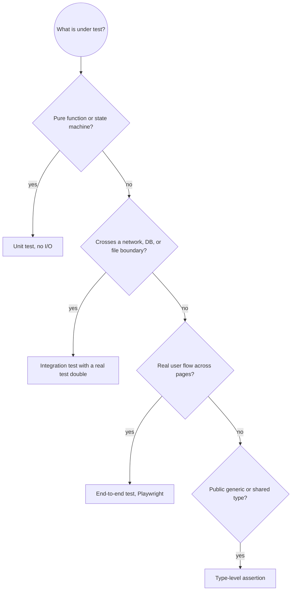

# TypeScript Testing

A test that mocks the thing it is meant to verify proves nothing. The patterns below keep tests close to real behavior, assert observable outcomes, and cover the error paths that catch production bugs.

## Quick Reference

| Category | Rule | How to Apply |
| --- | --- | --- |
| **Structure** | Arrange, Act, Assert | One clear block per test; no shared mutable state |
| | Fresh state per test | Build fixtures in `beforeEach`, not at module scope |
| | One behavior per test | Split when the name needs an "and" |
| | Descriptive names | "throws when the balance is negative", not "test1" |
| **Isolation** | Prefer real implementations | Use in-memory repos or a test DB over mocks |
| | Inject dependencies | Constructor injection makes a fake easy and honest |
| | `msw` for HTTP | Intercept at the network layer, not `fetch` |
| | Restore spies | `afterEach(() => vi.restoreAllMocks())` |
| **Async** | Return or `await` the promise | A test that does not await passes before the assertion |
| | `await expect(p).rejects.toThrow()` | Assert rejections, not just resolutions |
| | Fake timers carefully | Advance with `vi.advanceTimersByTimeAsync` |
| | No arbitrary sleeps | Use real timers plus polling helpers, or fake timers |
| **Errors** | Test error paths | Every `throw`, early return, and rejected branch |
| | Assert the message or type | `toThrow("Division by zero")` beats `toThrow()` |
| | Test boundaries | Empty input, `null`, zero, max, off-by-one |
| **Types** | Type-level assertions | `expectTypeOf` on public generic APIs |
| | Test files are type-checked | Include tests in the tsconfig that owns the source |
| **Coverage** | Threshold in CI | Fail under the project's branch and function floor |
| | Coverage is a floor | 100 percent of a wrong test suite is still wrong |

## Reference Guide

Load `references/advanced-testing.md` for detailed examples: API integration with `supertest`, database repository tests, React component and hook tests, snapshot policy, coverage configuration, and timer and promise utilities.

## Test Selection Decision Flow



## Framework setup

Vitest is the default for Vite and modern Node projects. Jest remains common in older codebases. Both run TypeScript with minimal configuration.

```typescript
// vitest.config.ts
import { defineConfig } from "vitest/config";

export default defineConfig({
    test: {
        globals: true,
        environment: "node", // or "jsdom" for component tests
        coverage: {
            provider: "v8",
            reporter: ["text", "json", "html"],
            exclude: ["**/*.d.ts", "**/*.config.ts", "**/dist/**"],
        },
        setupFiles: ["./src/test/setup.ts"],
    },
});
```

```typescript
// jest.config.ts
import type { Config } from "jest";

const config: Config = {
    preset: "ts-jest",
    testEnvironment: "node",
    testMatch: ["**/__tests__/**/*.ts", "**/?(*.)+(spec|test).ts"],
    collectCoverageFrom: ["src/**/*.ts", "!src/**/*.d.ts"],
    coverageThreshold: {
        global: { branches: 80, functions: 80, lines: 80, statements: 80 },
    },
    setupFilesAfterEach: ["<rootDir>/src/test/setup.ts"],
};

export default config;
```

Prefer Vitest for new projects: faster startup, native ESM and TypeScript, and one config for test and build.

## Unit tests

Follow Arrange, Act, Assert. Test one behavior, and build fresh state per test so order never matters.

```typescript
import { describe, it, expect, beforeEach } from "vitest";
import { UserService } from "./user.service";

describe("UserService", () => {
    let service: UserService;

    beforeEach(() => {
        service = new UserService(); // fresh per test, no shared state
    });

    it("returns the created user by id", () => {
        const user = { id: "1", name: "John", email: "john@example.com" };
        service.create(user);

        expect(service.findById("1")).toEqual(user);
    });

    it("throws when the user already exists", () => {
        const user = { id: "1", name: "John", email: "john@example.com" };
        service.create(user);

        expect(() => service.create(user)).toThrow("User already exists");
    });
});
```

Table-driven tests cover many inputs with one body. Vitest's `it.each` and Jest's `test.each` both work.

```typescript
it.each([
    [2, 3, 5],
    [-2, -3, -5],
    [0, 5, 5],
])("add(%i, %i) returns %i", (a, b, expected) => {
    expect(add(a, b)).toBe(expected);
});
```

Always test the boundaries, not just the happy path: empty input, `null` and `undefined`, zero, negative values, the maximum, and off-by-one on each index.

## Async tests

A test that forgets to `await` passes before the assertion runs. Return or await every promise, and assert rejections explicitly.

```typescript
it("rejects when the user is missing", async () => {
    await expect(service.fetchUser("999")).rejects.toThrow("User not found");
});
```

For timers, use fake timers and advance them deliberately. Do not use arbitrary `setTimeout` sleeps; they are slow and flaky.

```typescript
import { vi } from "vitest";

it("debounces calls", async () => {
    vi.useFakeTimers();
    const fn = vi.fn();
    const debounced = debounce(fn, 100);

    debounced("a");
    debounced("b");
    await vi.advanceTimersByTimeAsync(100);

    expect(fn).toHaveBeenCalledTimes(1);
    expect(fn).toHaveBeenCalledWith("b");
    vi.useRealTimers();
});
```

## Mocking strategy

Order of preference, best first:

1. **Real implementation.** An in-memory repository or a real test database.
2. **Injected fake.** A hand-written implementation of the interface the code depends on.
3. **Network interception.** `msw` for HTTP, so the code under test exercises its real client.
4. **Module mock.** `vi.mock` or `jest.mock`, as a last resort.

```typescript
// GOOD: in-memory implementation honors the real contract
class InMemoryUserRepository implements UserRepository {
    private users = new Map<string, User>();
    async findById(id: string): Promise<User | null> {
        return this.users.get(id) ?? null;
    }
    async save(user: User): Promise<void> {
        this.users.set(user.id, user);
    }
}
```

Dependency injection makes the fake possible without module mocking:

```typescript
export class UserService {
    constructor(private readonly repo: UserRepository) {}

    async getUser(id: string): Promise<User> {
        const user = await this.repo.findById(id);
        if (!user) throw new Error("User not found");
        return user;
    }
}
```

When you must mock, restore the original afterward so one test cannot leak into the next:

```typescript
import { vi, afterEach } from "vitest";

afterEach(() => {
    vi.restoreAllMocks();
});
```

Prefer `msw` over stubbing `global.fetch`. It keeps the real request shape and fails loudly on an unhandled route.

```typescript
import { http, HttpResponse } from "msw";
import { setupServer } from "msw/node";

const server = setupServer(
    http.get("https://api.example.com/users/:id", () =>
        HttpResponse.json({ id: "1", email: "a@b.com" })),
);

beforeAll(() => server.listen());
afterEach(() => server.resetHandlers());
afterAll(() => server.close());
```

## Integration tests

Integration tests verify real HTTP and database behavior. Use `supertest` against the app instance and a disposable test database, truncating tables in `beforeEach`.

```typescript
import request from "supertest";
import { app } from "../app";
import { db } from "../db";

beforeEach(async () => {
    await db.query("TRUNCATE users RESTART IDENTITY CASCADE");
});

it("creates a user", async () => {
    const res = await request(app)
        .post("/users")
        .send({ email: "a@b.com" })
        .expect(201);

    expect(res.body).toMatchObject({ email: "a@b.com" });
});
```

For a real database use `testcontainers` or a documented local test DB. Never point integration tests at a shared or production database.

## Frontend testing

Render components and query by role or label, the way a user finds them. Prefer `getByRole` and `getByLabelText` over `data-testid`.

```tsx
import { render, screen } from "@testing-library/react";
import userEvent from "@testing-library/user-event";

it("submits the form", async () => {
    const onSubmit = vi.fn();
    render(<UserForm onSubmit={onSubmit} />);

    await userEvent.type(screen.getByLabelText(/email/i), "a@b.com");
    await userEvent.click(screen.getByRole("button", { name: /save/i }));

    expect(onSubmit).toHaveBeenCalledWith({ email: "a@b.com" });
});
```

Test hooks with `renderHook` and wrap state updates in `act`.

```tsx
import { renderHook, act } from "@testing-library/react";

it("increments", () => {
    const { result } = renderHook(() => useCounter());
    act(() => result.current.increment());
    expect(result.current.count).toBe(1);
});
```

Test behavior, not internals. Asserting on a private field (`service["_cache"].size`) breaks on every refactor and catches no real bug.

## Test data

Use factories with `@faker-js/faker` and allow overrides, so each test sets only the fields it cares about.

```typescript
import { faker } from "@faker-js/faker";

export function createUserFixture(overrides?: Partial<User>): User {
    return {
        id: faker.string.uuid(),
        name: faker.person.fullName(),
        email: faker.internet.email(),
        createdAt: faker.date.past(),
        ...overrides,
    };
}
```

## Type-level tests

Public generic APIs need a compile-time assertion as well as a runtime one. `expectTypeOf` (Vitest) and `expect-type` both fail the type check when the type is wrong.

```typescript
import { expectTypeOf } from "vitest";

it("parseUser returns User", () => {
    expectTypeOf(parseUser({ id: "1", email: "a@b.com" })).toEqualTypeOf<User>();
});

it("branded ids are not interchangeable", () => {
    // @ts-expect-error: OrderId is not a UserId
    getOrder(toUserId("1"), toUserId("2"));
});
```

Include test files in the tsconfig that owns the source so these assertions actually run during the type check.

## Coverage and CI

- Set a coverage threshold in the framework config or the CI step, and fail below it.
- Coverage is a floor, not a goal. A suite at 100 percent that only tests happy paths still misses the bugs that ship.
- Run tests with `--run` (Vitest) or `--ci` (Jest) in CI so watch mode never blocks.
- Run integration tests with a disposable database or `testcontainers`.

```bash
vitest run --coverage
jest --ci --coverage
```

## Common Pitfalls

| Mistake | Why it is wrong | Fix |
| --- | --- | --- |
| Mocking the module under test | The test verifies the mock, not the code | Use a real or injected implementation |
| Forgetting to `await` | The test passes before the assertion | Return or await every promise |
| Shared mutable state across tests | Test order changes the result | Build fresh state in `beforeEach` |
| Asserting on private fields | Breaks on refactor, catches nothing | Assert observable behavior |
| `data-testid` everywhere | Couples tests to markup | Query by role or label |
| Arbitrary `setTimeout` waits | Slow and flaky | Use fake timers or polling assertions |
| Testing only the happy path | Error handling is untested | Cover every throw and early return |
| No type-level test for a generic API | A refactor silently widens the type | Add `expectTypeOf` assertions |
| Snapshotting large objects | Updates become rubber-stamped | Assert specific fields |

## Skill Chaining

**Invoked by:** `typescript-dev` when adding tests, `typescript-code-review` for coverage gaps

**Works alongside:** `typescript-dev` for the code under test, `typescript-performance` when a test is slow
